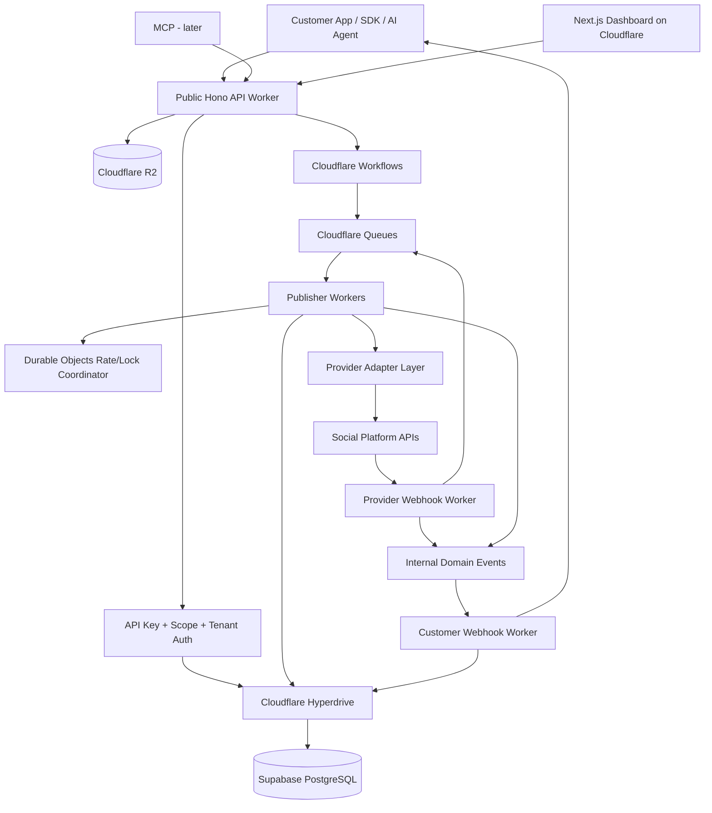
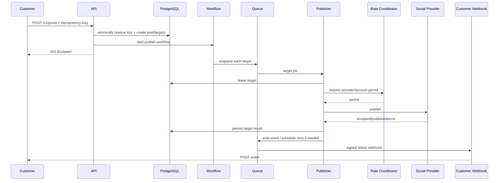

# Agent-Native Unified Social API
## Master Product, Architecture, and AI-Coding Build Plan

**Document date:** 7 August 2026  
**Revision:** Creator Studio + Smart Media Auto-Fit + Content Intelligence / Publisher Automation integrated  
**Purpose:** This document is intended to be handed directly to an AI coding agent as the master implementation plan for a production-grade unified social-media API platform.  
**Product objective:** Build a better core version of the existing unified social APIs first, make it production-usable from the earliest phase, and then evolve the same infrastructure into the best social execution layer for LLMs and autonomous agents.

---

# 0. Executive Decision

Build the product in this order:

1. **First create a production-grade unified publishing core.**
2. Make that core **multi-tenant, asynchronous, idempotent, observable, and provider-adapter based from day one**.
3. Make the API **agent-friendly from day one** through excellent schemas, capability discovery, preflight validation, deterministic errors, and concise machine-readable responses.
4. Add platforms by implementing adapters, **not by modifying the core publishing engine**.
5. After the commercial publishing core is stable, expose two first-party product surfaces on the **same API and domain services**:
   - a zero-effort **Creator Studio / Smart Universal Composer** for influencers, creators, small businesses and social managers
   - a **Content Intelligence & Universal Repurposing Engine** for publishers, media sites, blogs, CMS products, newsletters, video/audio creators and other source-content workflows
6. The Creator Studio must never become a second backend. It calls the same profile, connection, media, capability, preflight, post, scheduling and webhook/application services used by external API customers.
7. The Content Intelligence layer ingests source content, extracts grounded facts/structure, creates platform-specific drafts, adapts media, preflights every destination and hands approved drafts to the same unified publishing engine.
8. After these human/publisher surfaces are solid, add the differentiated agent layer:
   - MCP
   - agent permissions
   - approval policies
   - social memory
   - optimization loops
   - autonomous engagement
   - intelligence
9. Do **not** attempt to reproduce every Zernio feature before launching. The core must be usable after the first provider is connected and becomes commercially strong as the first four major providers are added.

The product should eventually be positioned as:

> **The social execution infrastructure for software and AI agents — one API to connect, validate, publish, schedule, observe, engage and optimize across every supported social platform.**

The first deliverable is narrower:

> **One API. Multiple social networks. Production-grade publishing.**

## 0.1 Final Product Surfaces

The long-term platform is one backend with four primary clients:

```text
                       SHARED SOCIAL EXECUTION CORE
                profiles / connections / media / posts
               capabilities / preflight / queues / events
                              / analytics
                                   |
          +------------------------+-------------------------+
          |                        |                         |
   Developer API             Creator Studio          Content Automation
 SaaS / agencies /          creators / SMBs /        publishers / CMS /
 software products          social managers          RSS / media sites
          |                        |                         |
          +------------------------+-------------------------+
                                   |
                              Agent Layer
                       MCP / policies / memory /
                       approvals / optimization
```

**Architectural rule:** these are not four implementations. They are four interfaces over the same application/domain services.

Commercial progression:
1. infrastructure customers integrate immediately
2. creators directly use the same capabilities without writing code
3. publishers automate source-content-to-social workflows
4. agents later operate the same primitives under scoped permissions

---

# 1. Important Research Boundary

No public competitor exposes its private production source code, infrastructure topology, database schema, internal queues, deployment settings, encryption keys, or proprietary algorithms.

Therefore this plan distinguishes between:

## 1.1 Publicly observable/documented facts

These include:
- API contracts
- resource models
- documented retry behavior
- webhook semantics
- multi-tenant model
- published architecture guidance
- open-source implementation patterns
- public SDK/MCP behavior
- OAuth flows
- platform-specific documented constraints

## 1.2 Engineering inference

Where a vendor does not publish internals, this plan infers the infrastructure required to support its documented behavior. Those inferences are used as design input, **not represented as private facts about competitors**.

## 1.3 Open-source reference

Postiz is especially useful because its public repository shows an actual production-oriented stack using Next.js, NestJS, PostgreSQL/Prisma and Temporal. It demonstrates why durable workflow orchestration and throttling become important as social integrations grow.

---

# 2. What the Competitive Research Shows

## 2.1 Zernio — strongest lessons

Zernio currently exposes a broad unified API with profiles, social accounts, posts, scheduling/queueing, validation, analytics, inbox, webhooks, advertising and MCP.

Important architectural lessons from its public documentation:

### Tenant abstraction
Zernio recommends one `profile` per downstream customer/brand. Social accounts live under profiles.

**Lesson for us:** a first-class downstream tenant/brand object is mandatory.

### Multi-target post
A post can target several platform/account pairs.

**Lesson for us:** one logical post must fan out into multiple independently stateful publish targets.

### Asynchronous lifecycle
Publishing has aggregate states such as scheduled/publishing/published/failed/partial, while per-platform events expose individual outcomes.

**Lesson for us:** a post is not one synchronous HTTP operation.

### Webhook-first design
Zernio recommends webhooks instead of frequent polling, with stable event IDs, HMAC signing, retries and a dead-letter path.

**Lesson for us:** customer webhooks must be first-class infrastructure, including replay/debugging.

### Idempotency
Zernio documents request-level duplicate protection and content-fingerprint duplicate detection.

**Lesson for us:** duplicate prevention must happen before social side effects.

### Media indirection
Zernio provides presigned upload flows instead of forcing large uploads through the API request.

**Lesson for us:** direct-to-object-storage uploads are mandatory.

### Unified model + platform-specific data
Common publishing fields are normalized while special provider options remain available.

**Lesson for us:** never force all platforms into the lowest common denominator.

### Validation
Zernio exposes dry-run/preflight validation.

**Lesson for us:** an LLM should be able to ask "can this be published?" before executing it.

### Agent surface
Zernio exposes hundreds of MCP operations but uses a smaller always-present core plus discovery for the larger catalog.

**Lesson for us:** do not dump hundreds of tools into an agent context.

### Opportunity to improve
Zernio's public multi-tenant guide says posts validate an account ID against the team rather than strictly against a profile, leaving some account-to-customer ownership enforcement to the integrator.

**Our design improvement:** profile/tenant ownership is enforced inside our service and database on every operation, not delegated to the customer.

---

## 2.2 Ayrshare — strongest lessons

Ayrshare demonstrates a mature SaaS-to-SaaS model:

### Primary API credential + downstream Profile-Key
A direct customer can manage many downstream user profiles.

**Lesson:** distinguish our direct SaaS customer from that customer's connected brands/users.

### Exact-body validation endpoint
The same payload that will publish can be sent to validation first.

**Lesson:** validation must reuse the exact canonical publishing pipeline and schema.

### Scheduled pre-validation
Scheduled content can be checked before acceptance.

**Lesson:** fail early when possible.

### Partial success awareness
Social publishing can succeed on some destinations and fail on others.

**Lesson:** never treat a multi-network post as one atomic external transaction.

### Retry caution
Ayrshare warns that a provider may return an apparent failure even after content was published.

**Lesson:** "exactly once" cannot be guaranteed purely from HTTP responses; a reconciliation step is needed before dangerous retries.

### Approval workflow
Ayrshare offers approval-aware posts.

**Lesson:** our domain model should support approval from the beginning even if the advanced agent policy UI arrives later.

### Idempotency limitation worth improving
Ayrshare documents that simultaneous duplicate requests can race before an idempotency key is registered.

**Our design improvement:** reserve idempotency keys atomically in PostgreSQL using a unique constraint/transaction before creating downstream work.

---

## 2.3 Upload-Post — strongest lessons

Upload-Post emphasizes ease of publishing and media.

### Auto-transcoding
One video can be resized/cropped/optimized for platform destinations.

**Lesson:** media normalization is a valuable differentiator, but it should be implemented as a dedicated media-processing service, not embedded in the core Worker.

### White-label connection flow
A SaaS creates a profile, generates a signed/JWT connection URL and lets the end user connect accounts.

**Lesson:** our hosted connection experience must be embeddable and brandable.

### Multiple authentication strategies
Not all providers use OAuth. Discord, Telegram and other platforms may use webhook URLs, bot tokens or API tokens.

**Lesson:** provider connection architecture must support strategy types, not just `oauth2`.

### Account-health webhooks
Reauthorization and disconnected states are explicit.

**Lesson:** token/account health must be modeled as its own lifecycle.

### Agent tooling
Upload-Post provides MCP and an agent-facing API surface.

**Lesson:** after the REST core is stable, MCP should be thin orchestration over the same contracts, not a second business-logic implementation.

---

## 2.4 Postiz — strongest open-source lessons

Postiz publicly uses:
- TypeScript-heavy monorepo
- Next.js
- backend service architecture
- PostgreSQL
- Temporal
- throttling/queueing infrastructure

**Lesson:** social-media automation quickly becomes a durable-workflow problem, not merely CRUD + cron.

We will use Cloudflare Workflows and Queues initially rather than operating Temporal ourselves, but domain boundaries must stay clean enough that orchestration could later move to Temporal or another engine without rewriting provider adapters.

---

## 2.5 Mixpost — strongest lessons

Mixpost emphasizes:
- workspaces
- team collaboration
- platform-specific content versions
- calendar
- media library
- self-hosting

**Lesson:** platform-specific content variants and a very clean workspace/calendar UX matter even for an API-first company.

---

## 2.6 Unipile — strongest lessons

Unipile's strength is a normalized communications layer across social/messaging/email/calendar-style services.

**Lesson:** after publishing, a unified inbox/conversation model can materially expand the product's value. Do not build it into Phase 1, but design account/provider identifiers so messages can later be attached without schema surgery.

---

## 2.7 Nango/general unified-API architecture — strongest lesson

A rigid single normalized schema eventually breaks because provider capabilities differ.

Therefore use:

> **Stable unified primitives + explicit provider-native escape hatches.**

This is one of the most important design rules in this entire project.

## 2.8 Buffer — strongest creator/AI lessons

Buffer's public product/docs demonstrate creator expectations such as one composer, platform-specific customization, AI-assisted repurposing, rewriting and scheduling.

**Lesson:** creator convenience should sit directly above the publishing API, and platform-specific adaptation should be automatic by default rather than forcing the user to memorize network rules.

## 2.9 Later — strongest media-friction lesson

Later publicly documents network-specific media requirements and, in its 2026 product updates, automatic resizing of incompatible TikTok images with preview before scheduling.

**Lesson:** do not merely report media incompatibility. Detect it, create a compliant variant when safe, preserve focal content when possible, preview the change and publish the transformed target-specific variant.

## 2.10 Missinglettr / publisher automation — strongest content-source lesson

Missinglettr demonstrates demand for converting blog/RSS source content into sequences of social posts.

**Lesson:** publishers should be able to connect a source once and receive grounded, platform-ready drafts whenever new content appears.

## 2.11 Competitive synthesis

```text
Zernio/Ayrshare
  -> unified infrastructure, multi-tenancy, publishing, webhooks, analytics

Upload-Post
  -> low-friction connection and media handling

Postiz
  -> durable workflow mindset

Mixpost/Buffer/Later
  -> strong human composer/calendar/content customization UX

Missinglettr
  -> source-content automation and evergreen repurposing

Our improvement
  -> one strict multi-tenant execution core
     + automatic capability enforcement
     + intelligent media auto-fit
     + grounded content intelligence
     + source-to-social API
     + agent-readable actions/errors
     + later autonomous agent governance
```

The platform competes in three existing categories using one infrastructure—unified social API, creator publishing workspace and content repurposing/automation—then builds a governed social execution layer for AI agents above them.

---

# 3. Product Principles — Non-Negotiable

The coding agent must preserve all of the following.

## P1. Core and adapters are separate

No Meta/TikTok/LinkedIn-specific business logic may leak into the generic post orchestration service.

## P2. One logical post has N publish targets

Each target has its own state, attempts, errors, provider ID and provider URL.

## P3. External publishing is asynchronous

`POST /v1/posts` should acknowledge accepted work quickly. It must not keep the HTTP request open while waiting for every social network.

## P4. Effective-once semantics

Cloudflare Queues and webhooks are at-least-once systems. The application must make duplicate execution safe.

## P5. Tenant isolation is server enforced

Never trust a caller-supplied `profile_id`, `account_id`, `media_id` or `post_id` without verifying project/environment/profile ownership.

## P6. Unified does not mean crippled

Provide canonical common fields plus `targets[].options` / provider-native typed extensions.

## P7. Validation is part of the product

Every provider adapter owns validation logic and capability metadata.

## P8. Webhooks are a product surface

Signed delivery, retries, logs and replay are mandatory.

## P9. Provider tokens are secrets

Never store them in plaintext application tables or logs.

## P10. Everything important is observable

Each request, workflow, provider call, retry and webhook delivery gets a correlation/trace ID.

## P11. APIs are the source of truth

The dashboard itself should consume the same domain contracts. No dashboard-only business logic.

## P12. Agent-ready from Phase 1

Stable error codes, JSON Schema/OpenAPI, small predictable responses, capability discovery and preflight exist before MCP.

## P13. Platform approval is a parallel workstream

Meta/TikTok/YouTube/LinkedIn app review and compliance work starts immediately. Coding cannot substitute for platform approval.

## P14. No rewrite-oriented phases

Every phase must extend the domain model and adapter system rather than replace it.

## P15. Creator Studio is an API client
Creator publishing uses the same application services/contracts as external API publishing. UI-only publication logic is forbidden.

## P16. Users should not memorize platform specifications
Character limits, media constraints, privacy requirements, supported post types and destination capabilities belong in the capability/specification engine.

## P17. Auto-fix before asking the user to fix
When a deterministic safe transformation can make content compliant, prepare it automatically and show the result.

## P18. Source-grounded generation
When repurposing a source, generated factual claims must be traceable to the extracted source model. Do not invent facts merely to improve engagement.

## P19. AI is optional around publishing
Manual publishing must continue to work without AI. AI improves creation but is not a dependency of the core publishing engine.

## P20. Automation defaults to review
Source-to-social automation initially creates ready-to-publish drafts. Fully automatic publishing is an explicit user policy.

---

# 4. Recommended Technology Stack

## 4.1 Primary language: TypeScript

Use TypeScript end-to-end for:
- public API Worker
- provider adapters
- queue consumers
- workflows
- dashboard
- SDK generation wrappers
- MCP server
- validation schemas
- shared domain contracts

### Why TypeScript
- strongest shared type ecosystem across Next.js and Cloudflare Workers
- Web Crypto/Web APIs work naturally at the edge
- very strong AI coding support
- one type system for REST/OpenAPI/dashboard/MCP
- simplest solo-founder maintenance

Do not introduce Go/Rust/Python into the main product prematurely.

A separate media-transcoding service may later use a containerized FFmpeg worker with Node/TypeScript orchestration or Go if benchmarking proves necessary.

### Python decision

**Python is not required simply because the product integrates many APIs or uses LLMs.**

Social providers, CMS systems and model providers expose HTTP APIs that TypeScript can call directly. Keep the primary codebase TypeScript. Python is acceptable later only for an isolated workload with a measured ecosystem advantage, such as a specialized ML/video-analysis pipeline. Never introduce Python as a second general backend without a concrete need.

## 4.2 AI / model-provider layer

The Content Intelligence and later Agent layers use a provider-neutral interface:

```ts
interface LanguageModelProvider {
  generateStructured<T>(input: StructuredGenerationInput<T>): Promise<T>;
  embed?(input: EmbedInput): Promise<EmbedResult>;
}
```

Application/domain code must not directly depend on a model-vendor SDK. Record model ID, prompt version, schema version, tokens, latency, cost and validation outcome for each generation run. LLM outputs are proposals until schema and grounding checks pass.

---

## 4.2 Frontend/dashboard

- Next.js App Router
- deployed to Cloudflare Workers using OpenNext
- Tailwind CSS
- shadcn/ui or similarly composable accessible component system
- React Hook Form
- Zod
- TanStack Query where client-side server-state caching helps
- server components where appropriate
- no business-critical publishing logic in Server Actions

### Deployment rule
Pin the exact Next.js/OpenNext versions in the lockfile after compatibility testing. Do not allow unattended major framework upgrades.

---

## 4.3 Public REST API

Use a **separate Cloudflare Worker** with:

- Hono
- TypeScript
- `@hono/zod-openapi` or equivalent OpenAPI integration
- Zod schemas
- explicit API version `/v1`
- Cloudflare bindings for Queues, Workflows, Durable Objects, R2, Hyperdrive, Secrets Store

### Why not use Next.js Route Handlers for the public API?
Because the API is the product. It needs:
- independent deployment
- independent rate limits
- stable versioning
- stable latency
- smaller blast radius
- framework independence
- easy SDK/OpenAPI generation

Dashboard and public API must be separately deployable.

---

# 5. Data & Cloud Architecture

## 5.1 Source-of-truth database: Supabase PostgreSQL

Use Supabase for:
- PostgreSQL
- Auth for human dashboard users
- database backups/PITR according to plan
- RLS for dashboard-facing data paths
- SQL functions/triggers where justified

## 5.2 API/worker database connectivity: Cloudflare Hyperdrive

Connect Workers directly to Supabase PostgreSQL through Cloudflare Hyperdrive.

Use:
- a dedicated database role for application workers
- least privileges
- direct Supabase connection string behind Hyperdrive
- Postgres.js or a supported edge-compatible PostgreSQL driver
- Drizzle ORM for typed schema/query construction where it helps
- raw SQL for transactions/locking/atomic idempotency when clearer

Do not use a service-role Supabase key as the universal authorization mechanism for the public API.

## 5.3 Supabase RLS

Enable RLS on all browser-exposed tables.

The dashboard's user-facing access must be constrained by:
- organization membership
- project membership
- role
- environment
- profile

Backend Workers using the dedicated database role still perform explicit authorization checks.

Defense in depth is required.

---

# 6. Cloudflare Components and Exact Responsibilities

## 6.1 Workers
Use for:
- public API gateway
- OAuth callback endpoints
- provider API clients
- webhook ingress
- webhook egress consumers
- queue consumers
- lightweight validation
- account-health operations
- SDK documentation endpoints

## 6.2 Cloudflare Queues
Use for high-volume asynchronous work:
- per-target publishing
- webhook delivery
- analytics sync
- account health checks
- token refresh jobs
- provider reconciliation
- post-processing
- media metadata probing
- background history sync

Properties we must design around:
- at-least-once delivery
- retries
- delayed retries
- DLQ
- bounded concurrency
- messages must contain IDs/references, not huge payloads

## 6.3 Cloudflare Workflows
Use for durable orchestration:
- scheduled publishing (`sleepUntil`)
- multi-step publish workflows
- approval waits
- long provider processing waits
- future agent human-in-the-loop actions
- compensation/reconciliation sequences

Do **not** use a huge number of per-minute cron triggers to publish scheduled posts.

A workflow can sleep until `scheduled_at`, then fan out targets.

Maintain a periodic reconciliation Cron Trigger only as a safety net.

## 6.4 Durable Objects
Use selectively as coordination primitives:

### Provider/account rate limiter
Object key example:

`rate:{provider}:{social_account_id}`

Responsibilities:
- token-bucket/leaky-bucket state
- serialize operations that providers require serialized
- protect refresh-token rotation
- enforce per-account/provider cooldown
- track `Retry-After`
- optionally coordinate concurrent media/publish operations

### Tenant fairness limiter
Object key:

`fairness:{project_id}`

Use only if queue-level concurrency does not provide sufficient fairness.

Do not place durable business data only in Durable Objects. PostgreSQL remains the source of truth.

## 6.5 R2
Use for:
- uploaded images/videos/documents
- temporary media
- generated thumbnails/previews
- normalized/transcoded media outputs later
- raw provider webhook samples only if scrubbed and retention-controlled

Upload clients directly using short-lived presigned URLs.

## 6.6 Secrets Store / environment secrets
Use Cloudflare Secrets Store / Worker Secrets for:
- application provider client secrets
- encryption key material
- webhook signing roots
- Stripe secret
- internal service authentication

Per-user social OAuth tokens should not be placed individually into Cloudflare account-level Secrets Store.

They belong in encrypted database records because they are high-cardinality application data.

---

# 7. Token and Credential Security

## 7.1 Recommended token storage

Store social access/refresh tokens as **application-layer encrypted ciphertext** in PostgreSQL.

Suggested record fields:

```text
credential_id
connection_id
credential_type
ciphertext
nonce
algorithm
key_version
expires_at
refresh_expires_at
created_at
updated_at
```

Use:
- AES-GCM through Web Crypto
- a root encryption key/KEK held outside PostgreSQL in Cloudflare Secrets Store
- key versioning from the beginning
- associated authenticated data containing organization/project/connection IDs

This avoids giving broad SQL readers automatic access to decrypted provider tokens.

### Why not depend solely on Supabase Vault?
Supabase Vault is useful and can hold encrypted secrets, but high-cardinality, frequently refreshed OAuth credentials need very deliberate access controls. Application-layer envelope-style encryption gives the API layer explicit control and easier provider-token auditability.

Vault may still be used for selected backend/application secrets if desired.

## 7.2 Never log
Never log:
- access tokens
- refresh tokens
- auth codes
- client secrets
- raw Authorization headers
- full cookies
- webhook secrets
- private API keys

Redact provider request/response payload paths marked secret before persistence.

---

# 8. Core Multi-Tenant Domain Model

Use this hierarchy:

```text
Organization
  └── Project
       ├── Environment (test/live)
       │    └── Profile / Brand
       │         └── Social Connection(s)
       ├── API Keys
       ├── Webhook Endpoints
       ├── Provider Apps
       └── Usage / Billing
```

## 8.1 Organization
The paying/direct customer.

Examples:
- an AI SaaS company
- an agency
- an e-commerce platform
- an internal marketing team

## 8.2 Project
A product/application owned by the organization.

Example:
- `Acme AI Social App`

## 8.3 Environment
At minimum:
- `test`
- `live`

Keys, webhooks and data should be environment-scoped.

Do not let a test API key publish against live connections unless explicitly enabled.

## 8.4 Profile
A downstream customer, brand, business, location, creator identity or workspace.

This is the core white-label tenant primitive.

Examples:
- SaaS customer #5821
- "Nike India"
- Agency client "ABC Restaurant"

## 8.5 Social Connection
One authorization/credential relationship with a provider.

A connection can expose one or more publish destinations.

Example:
- one Facebook user OAuth connection may grant access to several Pages
- one LinkedIn authorization may grant several organizations
- Google Business may expose several locations

Therefore distinguish:

```text
Connection = credential/auth relationship
Destination = actual publishing target
```

Do not collapse these concepts.

---

# 9. Required Core Tables

The coding agent should implement migrations for at least the following.

```text
organizations
organization_members
projects
project_environments
profiles

provider_apps
oauth_sessions
social_connections
social_destinations
social_credentials
connection_scopes
connection_health_events

media_assets
media_variants

posts
post_targets
post_target_attempts
post_approvals

idempotency_keys

webhook_endpoints
webhook_subscriptions
outbound_webhook_events
webhook_deliveries

provider_events
provider_request_logs

api_keys
api_key_scopes

usage_events
usage_counters

audit_events

platform_capabilities
provider_versions
feature_flags
```

Later:

```text
external_posts
analytics_snapshots
analytics_metrics
comments
conversations
messages
contacts

brand_profiles
brand_memories

content_sources
source_items
source_item_versions
source_fetches
source_spans
content_extractions
content_assets
repurpose_jobs
social_draft_sets
social_drafts
draft_grounding_claims
content_automations
content_automation_runs
evergreen_campaigns

llm_runs
prompt_versions

agent_policies
agent_runs
agent_actions
experiments
```

All later resources remain scoped to the existing organization/project/environment/profile hierarchy.

---

# 10. Critical Database Constraints

The following uniqueness/foreign-key rules are important.

## 10.1 API keys
Unique hash, never store the raw key after creation.

## 10.2 Idempotency
Unique:

```text
(environment_id, api_key_id, idempotency_key)
```

or, if keys can rotate while retries continue:

```text
(environment_id, project_id, idempotency_key)
```

Reserve the row atomically before creating a post.

## 10.3 Destination ownership
Every `post_target.destination_id` must resolve through:

```text
destination
 -> connection
 -> profile
 -> environment
 -> project
```

and match the post's exact environment/profile rules.

## 10.4 Provider event dedupe
Unique:

```text
(provider, provider_event_id)
```

when the provider supplies a stable event ID.

Otherwise use a controlled fingerprint plus short dedupe window.

## 10.5 Webhook event
Each outbound customer-facing event has one stable internal UUID.

## 10.6 Publish attempt
Unique attempt sequence per target.

---

# 11. Core Post Model

## 11.1 Logical post

A logical Post describes the customer's intended cross-platform publication.

Example:

```json
{
  "profile_id": "pro_...",
  "content": {
    "text": "We are launching today.",
    "media_ids": ["med_123"]
  },
  "targets": [
    {
      "destination_id": "dst_instagram",
      "overrides": {
        "text": "We're live 🚀"
      },
      "options": {
        "instagram": {
          "type": "reel"
        }
      }
    },
    {
      "destination_id": "dst_linkedin",
      "options": {
        "linkedin": {
          "visibility": "PUBLIC"
        }
      }
    }
  ],
  "publish_at": null
}
```

## 11.2 Target-specific override order

Resolve final publish content in this order:

```text
canonical post content
   ↓
target content override
   ↓
provider-specific options
   ↓
provider capability/default resolver
```

## 11.3 Provider-native options

Use typed provider-specific namespaces, not one generic unvalidated JSON blob wherever possible.

Example:

```ts
type ProviderOptions =
  | { provider: "instagram"; data: InstagramPostOptions }
  | { provider: "linkedin"; data: LinkedInPostOptions }
  | { provider: "threads"; data: ThreadsPostOptions };
```

At the REST boundary the schema may expose:

```json
"options": {
  "instagram": { ... }
}
```

OpenAPI must define those shapes.

---

# 12. Publishing State Machines

## 12.1 Post aggregate state

```text
draft
validating
awaiting_approval
scheduled
queued
publishing
published
partially_published
failed
cancelled
```

Never derive the state only from timestamps.

## 12.2 Target state

```text
pending
blocked_validation
awaiting_approval
scheduled
queued
preparing_media
publishing
provider_processing
published
retryable_failed
permanent_failed
cancelled
unknown_reconciliation_required
```

## 12.3 Connection health

```text
healthy
refresh_due
refreshing
reauth_required
permission_missing
rate_limited
provider_degraded
disconnected
revoked
```

---

# 13. Public API Design

Base:

```text
https://api.example.com/v1
```

Use:
- JSON
- UTC ISO-8601 timestamps
- cursor pagination
- stable resource prefixes
- `Idempotency-Key`
- `X-Request-Id`
- `trace_id` in responses

## 13.1 Resource IDs

Use opaque stable IDs:

```text
org_
prj_
env_
pro_
con_
dst_
med_
pst_
ptg_
wh_
evt_
key_
```

Do not expose sequential database IDs.

Use UUIDv7/ULID internally or another sortable, globally unique identifier.

---

# 14. Phase-1 API Surface

## Accounts / profiles

```http
POST   /v1/profiles
GET    /v1/profiles
GET    /v1/profiles/{profile_id}
PATCH  /v1/profiles/{profile_id}
DELETE /v1/profiles/{profile_id}
```

## Connections

```http
POST /v1/connections/authorize
GET  /v1/connections
GET  /v1/connections/{connection_id}
POST /v1/connections/{connection_id}/refresh
POST /v1/connections/{connection_id}/disconnect
GET  /v1/connections/{connection_id}/destinations
```

## Hosted Connect Sessions

```http
POST /v1/connect-sessions
GET  /connect/{signed_session_token}
```

## Media

```http
POST /v1/media/uploads
POST /v1/media/uploads/{id}/complete
GET  /v1/media/{id}
DELETE /v1/media/{id}
```

## Capabilities

```http
GET /v1/platforms
GET /v1/platforms/{provider}/capabilities
GET /v1/destinations/{destination_id}/capabilities
```

## Validation

```http
POST /v1/posts/preflight
POST /v1/media/preflight
```

## Publishing

```http
POST /v1/posts
GET  /v1/posts
GET  /v1/posts/{post_id}
POST /v1/posts/{post_id}/cancel
POST /v1/posts/{post_id}/retry
POST /v1/posts/{post_id}/targets/{target_id}/retry
```

## Webhooks

```http
POST   /v1/webhooks
GET    /v1/webhooks
PATCH  /v1/webhooks/{webhook_id}
DELETE /v1/webhooks/{webhook_id}

GET  /v1/webhooks/{webhook_id}/deliveries
POST /v1/webhooks/{webhook_id}/test
POST /v1/webhook-deliveries/{delivery_id}/replay
```

## Developer observability

```http
GET /v1/requests/{request_id}
GET /v1/posts/{post_id}/timeline
GET /v1/provider-health
```

---

# 15. Canonical Publish Response

`POST /v1/posts` should return **202 Accepted** for asynchronous work.

Example:

```json
{
  "id": "pst_01...",
  "object": "post",
  "status": "queued",
  "profile_id": "pro_01...",
  "publish_at": null,
  "targets": [
    {
      "id": "ptg_01...",
      "provider": "instagram",
      "destination_id": "dst_01...",
      "status": "queued"
    },
    {
      "id": "ptg_02...",
      "provider": "linkedin",
      "destination_id": "dst_02...",
      "status": "queued"
    }
  ],
  "created_at": "2026-08-07T05:16:00Z",
  "request_id": "req_01...",
  "trace_id": "trc_01..."
}
```

A synchronous `publishNow` convenience flag may exist, but it should still use the async engine and only optionally wait a **short bounded time** for immediately completed targets.

Never make reliable publication depend on the client maintaining an HTTP connection.

---

# 16. Agent-Native Error Envelope

All product errors should use a stable structure:

```json
{
  "error": {
    "type": "validation_error",
    "code": "MEDIA_RATIO_UNSUPPORTED",
    "message": "The selected video is not valid for the TikTok destination.",
    "param": "content.media_ids[0]",
    "provider": "tiktok",
    "destination_id": "dst_...",
    "retryable": false,
    "agent_action": "create_or_select_a_9_16_video_variant",
    "suggested_actions": [
      {
        "action": "create_media_variant",
        "params": {
          "aspect_ratio": "9:16"
        }
      }
    ],
    "docs_url": "https://docs.example.com/errors/MEDIA_RATIO_UNSUPPORTED",
    "provider_error": {
      "code": "REDACTED_OR_NORMALIZED"
    },
    "request_id": "req_...",
    "trace_id": "trc_..."
  }
}
```

## Rules

- `code` is stable and documented.
- `message` is human readable.
- `agent_action` is machine-useful.
- `retryable` must be explicit.
- raw provider errors are sanitized.
- never force an LLM to parse an English sentence to decide what to do.

---

# 17. Capability Registry

This is a major product feature, not merely documentation.

Every provider adapter declares capabilities such as:

```json
{
  "provider": "instagram",
  "publishing": {
    "text_only": false,
    "image": true,
    "video": true,
    "carousel": true,
    "story": true,
    "reel": true
  },
  "actions": {
    "delete_post": true,
    "comments_read": true,
    "comments_reply": true,
    "dm_send": true
  },
  "constraints": {
    "max_text_length": 2200,
    "max_media_count": 10
  }
}
```

Important: account-specific capability can differ from generic provider capability because of:
- permissions/scopes
- creator/business account type
- subscription
- provider approval
- region
- provider rollout

Therefore:

```text
GET /platforms/{provider}/capabilities
```

returns generic capability, while:

```text
GET /destinations/{id}/capabilities
```

returns effective capability for that connected destination.

This is essential for LLM agents.

---

# 18. Preflight Validation Architecture

`POST /v1/posts/preflight` receives **the same request body** as `POST /v1/posts`.

It performs:

1. schema validation
2. tenant ownership validation
3. connection health check
4. required-scope check
5. provider capability check
6. text validation
7. media type/size/duration/aspect-ratio validation
8. provider-specific option validation
9. compliance metadata validation
10. schedule validation
11. estimated transformations
12. warnings
13. autofix suggestions

Response:

```json
{
  "valid": false,
  "targets": [
    {
      "destination_id": "dst_...",
      "provider": "linkedin",
      "valid": true,
      "warnings": []
    },
    {
      "destination_id": "dst_...",
      "provider": "tiktok",
      "valid": false,
      "errors": [
        {
          "code": "TIKTOK_PRIVACY_SELECTION_REQUIRED",
          "agent_action": "choose_allowed_privacy_level"
        }
      ]
    }
  ]
}
```

The validation pipeline should call adapter validators but **must not perform social publish side effects**.

---

# 19. Provider Adapter Contract

All providers implement the same internal interface.

Illustrative TypeScript:

```ts
export interface SocialProviderAdapter {
  readonly provider: ProviderName;
  readonly version: string;

  capabilities(context?: CapabilityContext): Promise<ProviderCapabilities>;

  auth: {
    createAuthorization(input: CreateAuthorizationInput): Promise<AuthRedirect>;
    exchangeCallback(input: AuthCallbackInput): Promise<AuthResult>;
    refresh(input: RefreshCredentialInput): Promise<RefreshResult>;
    revoke(input: RevokeCredentialInput): Promise<void>;
    inspect(input: InspectCredentialInput): Promise<ConnectionIdentity>;
  };

  destinations: {
    list(input: ListDestinationsInput): Promise<ProviderDestination[]>;
  };

  publishing: {
    validate(input: ValidateTargetInput): Promise<ValidationResult>;
    prepare(input: PrepareTargetInput): Promise<PreparedPublish>;
    publish(input: PublishTargetInput): Promise<PublishResult>;
    status?(input: PublishStatusInput): Promise<PublishStatusResult>;
    findPossibleDuplicate?(input: ReconcileInput): Promise<ReconcileResult>;
    delete?(input: DeletePublishedPostInput): Promise<DeleteResult>;
  };

  normalizeError(error: unknown, context: ProviderErrorContext): NormalizedProviderError;

  verifyWebhook?(request: Request): Promise<VerifiedProviderEvent>;
}
```

## Strict rule
No route handler should import Meta/LinkedIn/TikTok SDKs directly.

All provider interaction must pass through the provider package.

---

# 20. Authentication Strategy Abstraction

Provider adapters must declare one of:

```text
oauth2
oauth2_pkce
oauth1
manual_token
bot_token
webhook_url
api_key
app_password
custom
```

This prevents later platforms from breaking an OAuth-only model.

---

# 21. OAuth Flow

## 21.1 Start
Client:

```http
POST /v1/connections/authorize
```

body:

```json
{
  "profile_id": "pro_...",
  "provider": "linkedin",
  "redirect_uri": "https://customer.example.com/social/callback"
}
```

Server:
1. checks profile ownership
2. chooses platform-managed or customer BYO provider app
3. creates short-lived `oauth_session`
4. generates cryptographically random state
5. stores PKCE verifier when applicable
6. binds session to project/environment/profile
7. returns provider authorization URL

## 21.2 Callback
Provider callback goes only to our controlled callback Worker.

Server:
1. verifies state
2. atomically marks session consumed
3. exchanges code
4. encrypts tokens
5. discovers authenticated identity
6. discovers available destinations/pages/orgs where applicable
7. creates or updates connection
8. emits internal `connection.connected`
9. emits customer webhook
10. redirects to approved return URL

## 21.3 Secondary selection
Some providers need:
- Facebook Page selection
- LinkedIn organization selection
- Pinterest board selection
- Google Business location selection

Model this generically as `destinations`.

The connection is not "fully ready" until required selections are complete.

---

# 22. Hosted White-Label Connect UI

Build this after the basic connect endpoint, but it belongs in the core product.

Customer requests:

```http
POST /v1/connect-sessions
```

Options:

```json
{
  "profile_id": "pro_...",
  "providers": ["instagram", "facebook", "linkedin", "threads"],
  "branding": {
    "logo_url": "...",
    "accent": "#..."
  },
  "return_url": "https://customer.app/settings/social",
  "expires_in": 900
}
```

Return a signed short-lived URL.

The end user sees:
- customer logo
- simple list of social providers
- Connected / Reconnect / Permission issue status
- destination selection
- no requirement to understand our dashboard

Later support fully headless customer-hosted flows for enterprise.

---

# 23. Provider App Ownership Model

Create the `provider_apps` table from Phase 1.

Fields include:

```text
project_id nullable
provider
ownership = platform_managed | customer_managed
client_id
encrypted_client_secret
callback_config
approval_status
scopes
metadata
```

Initially use **platform-managed provider apps** for the simplest integration.

Later enterprise users can bring their own:
- Meta app
- TikTok app
- Google project
- LinkedIn app
- X app

This must not require a schema rewrite.

---

# 24. Publishing Algorithm

## 24.1 API transaction

On `POST /v1/posts`:

1. authenticate API key
2. resolve project/environment
3. parse with versioned schema
4. atomically reserve `Idempotency-Key`
5. verify profile ownership
6. verify every destination belongs to allowed profile/environment
7. run fast preflight
8. create `posts`
9. create one `post_targets` row per destination
10. bind idempotency result to new post
11. commit
12. start Publish Workflow
13. return `202`

No provider publish call occurs inside the DB transaction.

## 24.2 Workflow

For immediate post:
- transition `queued`
- enqueue each target

For scheduled post:
- transition `scheduled`
- `sleepUntil(publish_at)`
- revalidate near publish time
- enqueue targets

For approval-required post:
- wait for approval event
- then schedule/publish

## 24.3 Target worker

For each target:

1. acquire target execution lease/atomic state transition
2. confirm not terminal
3. confirm connection healthy
4. refresh token if necessary under lock
5. ask rate limiter for permit
6. prepare media/provider payload
7. create attempt record
8. call provider
9. classify result

Possible outcomes:

```text
published
provider_processing
retryable_failed
permanent_failed
unknown_reconciliation_required
```

10. persist provider ID/URL/response summary
11. emit internal target event
12. recalculate aggregate post status
13. emit outgoing webhook event

---

# 25. Effective-Once Publishing

It is impossible to promise mathematically perfect exactly-once behavior across third-party APIs that do not themselves guarantee idempotency.

Promise instead:

> **Effectively-once publishing with duplicate prevention and reconciliation.**

Implement four layers:

## Layer 1 — request idempotency
Atomic unique key in PostgreSQL.

## Layer 2 — target execution lease
A target cannot be concurrently executed twice.

Use state transition such as:

```sql
UPDATE post_targets
SET status='publishing', lease_id=$1, lease_expires_at=$2
WHERE id=$3
  AND status IN ('queued','retryable_failed')
  AND (lease_expires_at IS NULL OR lease_expires_at < now())
RETURNING *;
```

Only the winner may publish.

## Layer 3 — content fingerprint
Optional safety protection:

```text
provider + destination + normalized content + media identity + scheduled time bucket
```

Do not make this an inflexible 24-hour prohibition. Allow:
- customer configured dedupe
- explicit `allow_duplicate=true`
- provider-specific policies

## Layer 4 — reconciliation before ambiguous retry
If network timeout occurs after a provider may have accepted the post:
- mark `unknown_reconciliation_required`
- call provider status/history/search when possible
- retry only when evidence suggests no publish occurred

This is superior to blindly repeating the provider request.

---

# 26. Partial Success

Example:

```text
Instagram -> success
LinkedIn  -> success
Threads   -> 429
Facebook  -> permission error
```

Aggregate:

```text
partially_published
```

Retry API must default to:

```text
retry only retryable failed targets
```

Never resubmit successful targets.

Expose:

```http
POST /v1/posts/{post_id}/retry
```

with:

```json
{
  "scope": "failed_targets"
}
```

---

# 27. Scheduling

Use Cloudflare Workflows as primary scheduler.

Workflow:

```text
Create post
  ↓
Preflight
  ↓
if approval -> waitForEvent()
  ↓
sleepUntil(publish_at)
  ↓
Revalidate
  ↓
Fan out target jobs
  ↓
Wait/observe terminal target events
  ↓
Aggregate final status
```

## Safety reconciler
A small Cron Trigger should periodically query:

```text
scheduled posts where publish_at < now() AND no active workflow/target work
```

and repair orphaned work.

Cron is a reconciler, not the main scheduling system.

---

# 28. Rate Limiting Has Four Different Meanings

Do not implement one global `requests/minute` counter and call it done.

## 28.1 Customer API rate limit
Protect our REST API.

Dimensions:
- organization
- project
- API key
- endpoint class
- plan

Return:
- `RateLimit-Limit`
- `RateLimit-Remaining`
- `RateLimit-Reset`
- `Retry-After`

## 28.2 Provider global/app limit
Example: limits applied to our app/client across all users.

## 28.3 Provider account/user limit
Example: per social account/user access token.

## 28.4 Action/velocity/compliance limits
Example:
- posts/day
- comments/hour
- API-specific quota bucket
- TikTok active creator caps

These constraints must live in the provider capability/limiter layer.

---

# 29. Rate-Limit Coordination with Durable Objects

Each provider adapter describes rate-limit dimensions.

Example:

```ts
rateLimitKeys(input) => [
  `linkedin:app:${providerAppId}`,
  `linkedin:member:${connectionId}`,
  `linkedin:destination:${destinationId}`
]
```

Durable Object keeps:
- known remaining budget
- reset timestamp
- cooldown
- recent 429 metadata
- concurrency semaphore

Worker requests permits before provider calls.

On provider `429`:
- parse provider retry/reset metadata
- update limiter
- queue target with delayed retry
- do not hammer provider

---

# 30. Queue Design

Recommended logical queues:

```text
publish-high
publish-default
publish-low
provider-webhook-ingest
customer-webhook-delivery
token-refresh
analytics-sync
account-health
reconciliation
media-probe
media-processing
dlq-publish
dlq-webhooks
```

Do not create one queue per customer.

Use message payload:

```json
{
  "schema_version": 1,
  "job_id": "job_...",
  "resource_type": "post_target",
  "resource_id": "ptg_...",
  "trace_id": "trc_..."
}
```

Load authoritative state from PostgreSQL.

---

# 31. Media Architecture

## Phase-1 behavior
Support:
- direct external HTTPS media URLs
- R2 uploaded media
- image metadata probe
- video metadata probe
- validations
- reuse one uploaded media asset across several targets

## R2 upload flow

```text
POST /media/uploads
   ↓
receive presigned URL + media_id
   ↓
browser/client PUT directly to R2
   ↓
POST /media/uploads/{id}/complete
   ↓
async metadata probe
   ↓
media ready
```

R2 key format:

```text
org/{org_id}/env/{env_id}/media/{media_id}/original
```

Do not make public bucket URLs permanent by default.

Use controlled temporary access when provider needs to fetch from a URL.

---

# 32. Media Processing Service — Later but Designed Now

Upload-Post's auto-transcoding is valuable. We should eventually outperform it.

Create an abstract job interface now:

```ts
interface MediaProcessor {
  probe(asset): Promise<MediaMetadata>;
  transform(request): Promise<MediaVariant>;
}
```

Phase 1 may only probe.

Later add a containerized FFmpeg service for:
- resize
- crop
- letterbox
- bitrate
- codec
- audio normalization
- thumbnail
- duration trimming
- aspect-ratio variants

Cloudflare Workers should orchestrate this, not run heavy FFmpeg.

A pull-based Cloudflare Queue can feed an external media compute service if that becomes the best deployment model.

---

# 33. Media Variant Reuse

If one source video must publish to:
- Instagram Reel
- TikTok
- YouTube Short
- LinkedIn

Generate reusable normalized variants keyed by transformation signature:

```text
sha256(source_hash + transform_spec_version + transform_parameters)
```

Do not transcode the same input repeatedly.

---

# 34. Inbound Provider Webhooks

Each provider gets a dedicated route:

```text
/webhooks/providers/meta
/webhooks/providers/linkedin
/webhooks/providers/tiktok
...
```

Handler:
1. verify provider signature
2. respond quickly
3. persist provider event / dedupe ID
4. enqueue processing
5. return required acknowledgment

Never run heavy processing before acknowledgment.

---

# 35. Outbound Customer Webhooks

Example event names:

```text
connection.connected
connection.reauth_required
connection.disconnected

post.accepted
post.scheduled
post.publishing
post.published
post.partially_published
post.failed
post.cancelled

post.target.publishing
post.target.published
post.target.failed

media.ready
media.failed
```

Later:

```text
comment.received
message.received
analytics.updated
approval.requested
agent.action.requires_approval
```

---

# 36. Webhook Delivery Semantics

Promise **at least once**.

Every event has stable:

```text
event_id
type
created_at
api_version
project_id
environment
profile_id
data
```

Sign exact raw body:

```text
timestamp.payload
```

using HMAC-SHA256.

Headers:

```text
X-Social-Event-Id
X-Social-Timestamp
X-Social-Signature
X-Social-Attempt
```

Customer should verify timestamp + signature to resist replay.

## Retry schedule
Implement exponential backoff with jitter, for example:

```text
0s
30s
2m
10m
1h
6h
24h
```

Then DLQ.

Dashboard must show:
- event
- endpoint
- HTTP code
- attempt count
- duration
- scrubbed response body excerpt
- next retry
- manual replay

---

# 37. Internal Event Model

Business logic must emit internal domain events independent of customer webhook formatting.

Example:

```ts
{
  type: "post.target.published",
  aggregateId: targetId,
  traceId,
  payload: {...}
}
```

Consumers can later include:
- webhook dispatcher
- analytics
- billing
- audit log
- notification system
- agent memory

This avoids tight coupling.

---

# 38. API Key System

Raw key format:

```text
sk_test_...
sk_live_...
```

Store:
- key prefix for dashboard identification
- SHA-256 or keyed hash of full token
- project/environment
- scopes
- optional profile restrictions
- created_by
- expires_at
- last_used_at
- revoked_at

Key is shown once.

Scopes example:

```text
profiles:read
profiles:write
connections:read
connections:write
posts:read
posts:write
media:write
analytics:read
inbox:read
inbox:write
webhooks:manage
```

Later allow profile-specific keys.

---

# 39. Human Dashboard Authentication

Use Supabase Auth for humans.

Roles:

```text
owner
admin
developer
marketer
analyst
billing
viewer
```

Permissions are organization/project scoped.

Do not use public API keys as normal dashboard sessions.

---

# 40. Observability — Must Be Better Than Competitors

Every external API request generates:

```text
request_id
trace_id
project_id
profile_id
provider
connection_id
destination_id
post_id
target_id
attempt_id
provider_endpoint_category
started_at
duration_ms
status_code
normalized_result
redacted_provider_request
redacted_provider_response
```

Retention may depend on plan.

## Dashboard views

### API Logs
Search by:
- request ID
- post ID
- profile
- provider
- status
- error code
- date

### Post Timeline
Example:

```text
10:00:00 accepted
10:00:01 preflight passed
10:00:02 Instagram target queued
10:00:02 LinkedIn target queued
10:00:03 Instagram publishing
10:00:04 LinkedIn publishing
10:00:07 LinkedIn published
10:00:11 Instagram provider processing
10:00:24 Instagram published
10:00:24 post published
10:00:25 customer webhook delivered
```

This is extremely valuable to developers.

---

# 41. Provider Status and Incident Handling

Maintain provider status state:

```text
operational
degraded
major_outage
auth_degraded
publishing_degraded
analytics_degraded
```

A failure classifier should distinguish:
- our bug
- customer credential
- invalid request
- provider rate limit
- provider server error
- provider moderation/rejection
- provider processing delay
- platform outage

Do not indiscriminately retry permanent errors.

---

# 42. Connection Health Engine

On every connection store:
- provider identity
- scopes
- expiry
- refresh status
- destination list
- last successful API call
- last refresh
- last health check
- health reason

Refresh strategy:
1. refresh opportunistically before expiry
2. background refresh inside provider-safe window
3. lock refresh per connection
4. if refresh token rotates, atomically replace
5. never let two workers refresh the same rotating token simultaneously

Emit `connection.reauth_required` when automated recovery is not possible.

---

# 43. Unified API + Native Escape Hatch

This is central.

Bad design:

```json
{
  "text": "...",
  "image": "..."
}
```

with no way to use new platform features.

Good design:

```json
{
  "content": {
    "text": "...",
    "media_ids": ["med_..."]
  },
  "targets": [
    {
      "destination_id": "dst_ig",
      "options": {
        "instagram": {
          "content_type": "reel",
          "collaborators": [],
          "location_id": null
        }
      }
    },
    {
      "destination_id": "dst_li",
      "options": {
        "linkedin": {
          "visibility": "PUBLIC",
          "disable_reshare": false
        }
      }
    }
  ]
}
```

New provider features can be added inside adapter-owned options without breaking canonical fields.

---

# 44. Provider Version Registry

Create:

```text
provider_versions
```

Fields:
- provider
- API version
- effective_from
- deprecated_at
- adapter version
- minimum required scopes
- notes

Example LinkedIn requires version headers; Meta Graph versions evolve.

Do not sprinkle version strings throughout code.

Provider adapter owns version configuration.

---

# 45. Feature Flags

All provider features should be controllable through:
- global flag
- project flag
- environment flag
- provider approval flag
- percentage rollout if needed

Examples:

```text
instagram_reels
threads_carousel
linkedin_documents
tiktok_direct_post
youtube_upload
```

This lets us disable a failing feature without taking down the whole provider.

---

# 46. OpenAPI Is a Product Artifact

Every REST route is generated/documented from shared schemas.

Required:
- OpenAPI 3.1
- examples
- error examples
- enums
- webhook schemas
- `operationId`
- security schemes
- deprecation metadata
- agent-friendly descriptions

Host:

```text
/openapi.json
/docs
/llms.txt
```

Do not manually maintain a separate API reference that drifts from code.

---

# 47. SDK Strategy

After REST contracts stabilize:

Generate base clients for:
- TypeScript/JavaScript
- Python

Hand-write ergonomic wrappers around the generated core.

Examples:

```ts
const post = await client.posts.create({
  profileId,
  content: { text: "Hello" },
  targets: [...]
});
```

SDK must:
- generate request IDs
- support idempotency key
- expose typed provider options
- verify webhooks
- surface typed errors
- support retries only for transport-safe calls

Do not auto-retry publish requests unless idempotency is present.

---

# 48. Agent-Readiness From Day One

Even before MCP, make the REST API ideal for agents.

## 48.1 Deterministic tool-like endpoints
Prefer clear verbs/resources.

## 48.2 Capabilities endpoint
Agent can discover what a destination supports.

## 48.3 Preflight
Agent can validate an intended action.

## 48.4 Structured remediation
Error gives `agent_action`.

## 48.5 Small responses
Default list endpoints return useful concise representations; use `expand=` for more.

## 48.6 Safe destructive actions
Deletion/revocation require explicit endpoints and optionally a confirmation token for agent use.

## 48.7 Test mode
Agents need a way to simulate.

---

# 49. Test / Simulation Mode

Provide a project environment where:

```json
{
  "mode": "simulate"
}
```

or separate test credentials.

Preflight and full orchestration run, but no external publish occurs.

Result:

```json
{
  "status": "simulated",
  "targets": [
    {
      "provider": "linkedin",
      "would_publish": true
    }
  ]
}
```

Eventually allow "provider test account" mode separately.

This becomes a major developer/agent feature.

---

# 50. MCP Design — After REST Core, Not Instead of It

MCP must consume the same service layer and schemas.

Do not create duplicate social logic.

## Initial curated tools

Keep the default set small:

```text
list_profiles
list_connections
get_capabilities
preflight_post
create_post
get_post
list_posts
cancel_post
retry_failed_targets
upload_media
get_media
list_webhook_events
get_provider_status
```

Then domain discovery:

```text
search_tools("instagram comments")
search_tools("analytics")
search_tools("inbox")
```

Do not expose 300+ tools in every prompt context.

---

# 51. Agent Authorization

Eventually support OAuth authorization into our MCP, not only static API keys.

An MCP access token should be scoped to:
- organization
- project
- environment
- profiles
- actions
- expiry

Example:

```text
allowed profiles: [pro_acme]
allow: posts:create, posts:read, analytics:read
deny: connections:delete
expires: 1 hour
```

This becomes the foundation of autonomous agent governance.

---

# 52. UI/UX Product Specification

The interface should be radically simpler than enterprise dashboards.

## 52.1 Onboarding success path

A new user should be guided through:

```text
Create account
  ↓
Create project
  ↓
Copy test API key
  ↓
Create first profile
  ↓
Connect first social account
  ↓
Create/publish test post
  ↓
See live status
  ↓
Configure webhook
  ↓
Switch to live
```

The dashboard home should always show the **next best action**.

---

# 53. Dashboard Navigation

Recommended navigation:

```text
Overview
Profiles
Connections
Create
  - Composer
  - Repurpose
Content Sources
Calendar
Posts
Media
Automations
API Keys
Webhooks
Logs
Usage
Developer
Settings
```

Later:

```text
Analytics
Inbox
Agents
Policies
Memory
Experiments
```

---

# 54. Overview Dashboard

Show only useful information:

- connected profiles
- healthy connections
- connections needing action
- posts published today
- failed targets
- webhook failures
- API usage
- provider incidents
- recent activity

Prominent CTA:
- Connect account
- Publish post
- Create API key

---

# 55. Profiles UI

Profile card:
- profile name
- customer/reference ID
- connected provider logos
- health status
- recent post count
- last activity

Profile detail:
- social connections
- destinations
- recent posts
- usage
- webhooks/events filtered to profile
- connection button

---

# 56. Connections UI

Each connection shows:

```text
Instagram
@brand
Healthy
Token expires: ...
Destinations: 1
Scopes: ...
Last successful call: ...
```

Problem state:

```text
LinkedIn
Permission missing
Reconnect
Required: w_organization_social
```

The UI should explain the fix, not merely display OAuth error codes.

---

# 57. Composer

Even though this is API-first, an excellent composer acts as:
- demo environment
- support/debugging tool
- customer utility
- feature discovery surface

Flow:
1. profile
2. destination selection
3. canonical content
4. target overrides
5. media
6. platform options
7. preflight
8. now/schedule
9. publish

Show per-platform preview and warnings.

---

# 58. Developer Playground

Build a Stripe-like API explorer:

Left:
- endpoint list

Center:
- editable typed request

Right:
- response / curl / SDK snippet

Auto-populate:
- current test API key
- selected profile
- destination

Button:
- Validate
- Execute in test
- Execute live (clear confirmation)

This can materially reduce onboarding friction.

---

# 59. Webhook UI

Must provide:
- endpoint editor
- event subscriptions
- secret rotation
- test event
- delivery list
- request body
- response status
- replay
- filtering

---

# 60. Logs UI

Developer should be able to answer:

> "Why did customer 847's Instagram Reel fail?"

in under a minute.

Search:
- profile
- post
- destination
- request ID
- provider
- error code

Show causal chain, not unrelated logs.

---

# 61. Accessibility and UI Quality Rules

- mobile responsive
- keyboard navigation
- accessible labels
- good empty states
- skeletons for async views
- optimistic UI only when safe
- never hide failed target states behind an aggregate "error"
- UTC internally; display user timezone
- every destructive action explicit
- copy buttons for IDs/curl
- sensible tooltips, not documentation walls

---

# 62. Platform Rollout Strategy

There are two kinds of platform priority:

## 62.1 Engineering reference providers
Use at least one low-friction provider early to prove architecture before app-review bottlenecks.

Candidate:
- Bluesky
- Telegram

This lets the entire publishing pipeline work almost immediately.

## 62.2 Commercial launch providers
Prioritize:

1. LinkedIn
2. Facebook Pages
3. Instagram Professional
4. Threads

Then:
5. TikTok
6. YouTube
7. Pinterest
8. Google Business Profile
9. X
10. Bluesky
11. Telegram
12. Discord

Evaluate Reddit according to its current commercial/developer-platform rules before committing.

---

# 63. Why TikTok/YouTube Require Early Compliance Work

TikTok's official Direct Post documentation states that unaudited clients are restricted to private publishing and must pass audit for normal public behavior. It also requires current creator information and explicit publishing/privacy UX.

YouTube documents that uploads from certain unverified API projects are restricted to private until compliance audit.

Therefore:

**Applications/audits are part of the critical path.**

Create a separate `PLATFORM_APPROVALS.md` on Day 1 and track:
- developer application
- test accounts
- privacy policy
- terms
- data deletion
- screencast/demo
- required UI
- scopes
- review state
- reviewer feedback
- resubmission

---

# 63A. AUTHORITATIVE CREATOR + CONTENT INTELLIGENCE EXPANSION

This section incorporates the later product decisions from the founder discussion. If any earlier sentence seems to conflict with this section, preserve the original unified publishing architecture but follow this section for Creator Studio, Smart Media Auto-Fit and Content Intelligence implementation.

## A. Architecture boundary

```text
Manual creator input ---------\\
Article / URL / RSS / CMS -----\\
Video / audio / PDF ------------> Content Intake
Existing content -------------/        |
                                   Content Intelligence
                                          |
                                    Social Draft Set
                                          |
                                    Smart Media Auto-Fit
                                          |
                                  Capability + Preflight
                                          |
                              Approval / Automation Policy
                                          |
                                      /v1/posts
                                          |
                                Unified Publishing Core
```

No source adapter, creator UI, CMS integration or LLM is allowed to call a social provider directly.

---

# 63B. Creator Studio

## Goal
Serve influencers, creators, personal brands, SMBs, social managers and agencies without requiring API knowledge.

## UX promise

> **Upload once. Write once. Select networks. We prepare everything else.**

The user should not need to memorize character limits, dimensions, codecs, durations, file sizes, privacy option names or API requirements.

## Modes

```text
Exact mode    -> preserve text/media as closely as possible
Optimize mode -> automatically adapt wording/media per network
Custom mode   -> user edits each target manually
```

Default Creator behavior: Optimize mode with preview.

---

# 63C. Smart Universal Composer

The Composer accepts text, images, video, documents, links, source content and existing drafts.

Pipeline:
1. identify destinations
2. load effective destination capabilities
3. resolve canonical content
4. evaluate text requirements
5. evaluate media requirements
6. create target variants
7. run Smart Media Auto-Fit
8. run per-target preflight
9. show consolidated readiness
10. permit target-specific edits
11. publish/schedule through the existing Post service

Example:

```text
READY TO PUBLISH
Instagram     ✓ Ready
Facebook      ✓ Ready
LinkedIn      ✓ Ready
Threads       ✓ Ready
TikTok        ⚠ Video adapted automatically
YouTube       ✕ Title required
```

Plain-language guidance appears first; technical details are expandable.

---

# 63D. Platform Specification Engine

Evolve the Capability Registry into a single structured engine used by REST, Creator Studio, Repurposing, MCP, agents, media processing and docs. It owns:

```text
post types
text/title/description limits
media count
formats
file size
dimensions
aspect ratio
duration
frame rate
codecs
thumbnail/cover requirements
privacy options
disclosures
account eligibility
API scopes
provider processing semantics
rate/velocity constraints
```

Effective specification:

```text
Provider Generic Specification
          +
Destination Account Capability
          =
Effective Publish Specification
```

Store the specification version used by each validation/publish attempt.

---

# 63E. Smart Media Auto-Fit

## Goal
Turn incompatible user media into compliant target-specific variants with minimal effort.

### Image transforms
- resize
- crop
- pad/letterbox
- format conversion
- quality/file-size optimization
- focal-point-aware crop
- safe-zone-aware crop
- optional background extension when explicitly enabled

### Video transforms
- resize/crop/pad
- bitrate and codec/container normalization
- frame-rate normalization when appropriate
- audio normalization
- thumbnail/cover generation
- aspect-ratio variants
- duration trim only when policy allows
- subtitle burn-in only when requested

## Decision classes

```text
PASS
SAFE_AUTOFIX
REVIEW_AUTOFIX
USER_DECISION_REQUIRED
UNSUPPORTED
```

Never silently perform destructive editorial changes such as removing content, changing words, inserting AI-generated pixels, changing playback speed or muting audio. Technical transcoding that preserves content may be automatic.

Generated variants must be cached/reused by source hash + transformation specification.

---

# 63F. Content Intelligence & Universal Repurposing Engine

## Product promise

> **Create once. Understand once. Adapt intelligently. Publish everywhere.**

This is not only for articles. It supports publishers, blogs, educational sites, newsletters, reports, product teams, podcasters, video creators, e-commerce, agencies and individual creators.

### Supported source abstraction

```text
manual_text
url
rss
atom
wordpress
ghost
webflow
shopify
generic_cms_webhook
generic_api
newsletter
pdf
document
image
video
audio
youtube_video
existing_social_post
product_page
press_release
research_report
```

Initial implementation priority:
1. URL
2. RSS/Atom
3. manual text
4. uploaded PDF/document
5. video/audio transcript
6. WordPress
7. generic webhook
8. more CMS integrations based on demand

---

# 63G. Source Adapter Contract

```ts
interface ContentSourceAdapter {
  type: ContentSourceType;
  discover?(input: DiscoverInput): Promise<DiscoveredItem[]>;
  fetch(input: FetchSourceItemInput): Promise<RawSourceContent>;
  normalize(input: RawSourceContent): Promise<NormalizedSourceDocument>;
  fingerprint(input: NormalizedSourceDocument): Promise<string>;
}
```

Source adapters normalize content. They do not generate posts and do not publish.

Normalized source:

```ts
interface NormalizedSourceDocument {
  sourceType: ContentSourceType;
  canonicalUrl?: string;
  title?: string;
  author?: string;
  publishedAt?: string;
  updatedAt?: string;
  text: string;
  sections?: SourceSection[];
  media: SourceMedia[];
  metadata: Record<string, unknown>;
}
```

---

# 63H. Source Discovery, Versioning & Deduplication

Store:

```text
canonical URL
source provider item ID
content fingerprint
published_at
updated_at
last_seen_at
```

Rules:
- unchanged canonical item -> no new repurpose job
- changed fingerprint -> create source version and optional update workflow
- tracking/query parameters do not create duplicates
- RSS duplicate events are idempotent
- RSS and CMS webhook discovery should converge on one source item when possible

---

# 63I. Grounded Extraction & Provenance

Before generation, create structured extraction:

```json
{
  "content_type": "news_article",
  "title": "...",
  "one_sentence_summary": "...",
  "key_points": [{"text":"...","source_span_ids":["span_12"]}],
  "facts": [{"statement":"...","source_span_ids":["span_18"],"confidence":0.98}],
  "statistics": [{"value":"...","context":"...","source_span_ids":["span_21"]}],
  "entities": [],
  "quotes": [],
  "calls_to_action": [],
  "source_url": "...",
  "available_media": []
}
```

Split normalized source text into stable source spans. Generated factual claims reference spans. A generated statistic, quote, name, date or factual assertion cannot be treated as source-grounded unless supported by the extraction/provenance model.

---

# 63J. Content-Type Classifier

Initial classes:

```text
news
analysis
tutorial
how_to
product_launch
product_update
research_report
press_release
event
opinion
newsletter
podcast
video
case_study
job_or_announcement
evergreen_educational
promotion
```

Classification influences social angle, freshness, CTA, use of data/quotes, default approval and evergreen eligibility. User override is allowed.

---

# 63K. Brand Profile

Per Profile store:

```text
display name
website
description
audiences
brand voice
tone
preferred vocabulary
forbidden vocabulary
product names
approved claims
required disclosures
link policy
hashtag policy
emoji policy
CTA style
locale/languages
platform-specific preferences
```

Only the context needed for the current generation should be sent to the LLM.

---

# 63L. Repurposing Pipeline

```text
Source Item
  -> Normalize
  -> Extract / classify
  -> Choose useful social angles
  -> Load brand context
  -> Load destination capabilities
  -> Generate canonical campaign intent
  -> Generate destination-specific drafts
  -> Grounding/factuality check
  -> Text/platform validation
  -> Media selection/transformation plan
  -> Smart Media Auto-Fit
  -> Full publish preflight
  -> Ready / Review / Blocked
```

Do not solve all stages with one giant prompt. Use typed, independently testable stages.

---

# 63M. Platform-Specific Drafts

A useful transformation is not merely truncation.

Examples:
- LinkedIn: professional hook + explanation + data + CTA
- Facebook: accessible summary + link context + optional question
- Instagram: caption + carousel outline/alt text/media plan when appropriate
- Threads/X-like: concise post or optional thread sequence
- YouTube: title + description + optional Short/script plan
- TikTok: caption + optional short-form script + disclosures/media plan

Current limits/options always come from the Platform Specification Engine, not from hard-coded prompt text.

---

# 63N. Draft Set Model & One-Click Publish

One source item creates a `social_draft_set`. Each draft targets a provider or destination and stores text/title/description, selected media, transformation plan, provider-native options, grounding, model/prompt metadata, preflight and editor changes.

A draft is **not** a Post until finalized.

Finalization converts the approved draft set into the existing canonical Post + target overrides and executes the normal `/v1/posts` flow.

The publishing engine must remain unaware of whether content came from a human, source repurposer, API, CMS, MCP or autonomous agent.

---

# 63O. Publisher / Media-Site Automation

Example configuration:

```text
Source: https://example.com/feed.xml
Trigger: new article
Actions:
  ingest
  extract
  generate selected-network drafts
  auto-fit media
  preflight
Approval: editor approval required
Then: publish immediately after approval
```

Dashboard result:

```text
New article detected
6 social drafts prepared
6/6 passed technical preflight
1 warning: Instagram image auto-fitted

[Review] [Approve All]
```

Later, trusted users can choose `auto_publish_if_safe` after explicit configuration.

---

# 63P. Automation Triggers & CMS Integrations

Triggers:

```text
rss_poll
cms_webhook
api_event
manual
scheduled_scan
file_uploaded
source_item_updated
```

Use webhooks when available and polling only when necessary. Do not create one Cloudflare Cron Trigger per customer feed. Use partitioned discovery jobs/workflows with ETag/Last-Modified/cursors and backoff.

Initial connectors:
1. RSS/Atom
2. WordPress
3. generic webhook
4. generic REST API
5. Ghost
6. Webflow
7. Shopify

---

# 63Q. Content Intelligence API

Add after the core publishing contracts stabilize:

```http
POST /v1/content/ingest
GET  /v1/content/items
GET  /v1/content/items/{item_id}

POST /v1/content/repurpose
GET  /v1/repurpose-jobs/{job_id}

GET   /v1/draft-sets/{draft_set_id}
PATCH /v1/draft-sets/{draft_set_id}
POST  /v1/draft-sets/{draft_set_id}/preflight
POST  /v1/draft-sets/{draft_set_id}/publish

POST   /v1/content-sources
GET    /v1/content-sources
PATCH  /v1/content-sources/{source_id}
DELETE /v1/content-sources/{source_id}

POST /v1/content-automations
GET  /v1/content-automations
PATCH /v1/content-automations/{automation_id}
```

---

# 63R. LLM Execution Rules

Use a provider-neutral Model Gateway. Required controls:
- structured output schemas
- prompt/schema versioning
- source span IDs
- input-size limits/chunking
- model/version logging
- timeout
- cost budget
- safe retry
- validation
- optional fallback
- extraction/result caching for unchanged content

Do not repeatedly analyze unchanged source content.

---

# 63S. Prompt Injection & Untrusted Source Defense

Web pages, PDFs, feeds and transcripts are untrusted data. Source text can contain malicious instructions.

Rules:
1. source text is data, never system/developer instruction
2. extraction calls get no publishing tools
3. generation calls cannot publish
4. secrets never enter model context
5. HTML is sanitized; scripts/styles/forms removed
6. model output is schema validated
7. suggested URLs are not fetched outside the SSRF-safe fetch layer
8. publication still requires normal authorization/policy/preflight
9. external enrichment is an explicit separate feature

---

# 63T. Review / Auto-Publish Policy

Automation modes:

```text
draft_only
approval_required
auto_publish_if_safe
```

`auto_publish_if_safe` evaluates source trust, grounding, content risk, destination health, media preflight, platform compliance, duplicate similarity, scheduling/rate constraints and configured sensitive topics.

Decisions:

```text
READY_FOR_REVIEW
READY_FOR_AUTOPUBLISH
REQUIRES_EDITOR
BLOCKED_TECHNICAL
BLOCKED_POLICY
```

Default for new source automations: `approval_required`.

---

# 63U. Evergreen / Multi-Post Repurposing

A source may optionally produce multiple social moments:

```text
Day 0  -> announcement/summary
Day 3  -> key fact/statistic
Day 10 -> takeaway
Day 30 -> evergreen insight
Day 90 -> only if still relevant
```

Safeguards:
- do not present old news as new
- source updates can invalidate scheduled drafts
- duplicate/similarity check before resurfacing
- user controls frequency/campaign length
- analytics can later suppress weak patterns

Default is one high-quality draft set, not an automatic year-long campaign.

---

# 63V. Analytics Feedback Loop

Once normalized analytics exists, recommendations can learn from format, topic, hook, media, timing and destination performance. Analytics recommendations begin as advisory and remain constrained by brand rules, originality, factuality and maximum repetition.

---

# 63W. Creator / Publisher UI

Create screen tabs:

```text
Compose
Repurpose
Import
```

Each destination card shows provider, destination, preview, text, selected media variant, warnings, specification usage and preflight state.

Global actions:

```text
Optimize all
Use exact wording
Regenerate selected
Apply media fixes
Preflight all
Schedule
Publish
```

Advanced provider options remain collapsed by default.

---

# 63X. New Data Model

Add later:

```text
brand_profiles
content_sources
source_items
source_item_versions
source_fetches
source_spans
content_extractions
content_assets
repurpose_jobs
social_draft_sets
social_drafts
draft_grounding_claims
content_automations
content_automation_runs
evergreen_campaigns
evergreen_campaign_items
llm_runs
prompt_versions
```

Relationships:

```text
profile -> brand_profile
profile -> content_sources
content_source -> source_items
source_item -> versions
source_item_version -> extraction
source_item_version -> draft_sets
draft_set -> drafts
draft_set -> final post (nullable until published)
```

---

# 63Y. New Testing Requirements

Platform/media tests:
- over-limit text
- wrong aspect ratio
- unsupported codec
- safe auto-fix
- destructive fix requires review
- account capability overrides provider generic capability

Source tests:
- RSS duplicate
- URL canonicalization
- changed source version
- malformed feed
- fetch timeout
- SSRF attempt
- HTML sanitization

LLM tests:
- invalid structured output
- unsupported/generated fact
- missing grounding
- prompt injection inside source
- long-source chunking
- cache unchanged source
- generation budget exceeded

Automation tests:
- new source -> one job
- duplicate source event -> one campaign
- approval required -> no publish
- failed preflight blocks auto-publish
- source update invalidates stale scheduled content when configured

---

# 63Z. Revised Product Execution Order

This is the authoritative high-level sequence:

```text
1. Strong unified publishing infrastructure
2. First real publish
3. LinkedIn + Facebook + Instagram + Threads
4. Excellent developer DX / white-label connect
5. Creator Studio / Smart Universal Composer
6. Smart Media Auto-Fit
7. Content Intelligence & Universal Repurposing
8. Publisher/RSS/CMS automation
9. More social networks
10. Analytics + optimization feedback
11. Unified inbox/engagement
12. MCP / agent execution
13. Agent governance
14. Social memory + autonomous optimization
```

The new layers must not delay the first real publish or destabilize the publishing core.

Success criteria:
- creator: upload/write once -> compliant previews -> publish everywhere
- publisher: connect source -> new content -> grounded drafts -> approve once -> publish everywhere
- developer: call content/repurpose -> publish draft set
- agent later: same workflow under scopes/policies/approval

---

# 64. PHASED IMPLEMENTATION PLAN

The phases below are intentionally arranged so the system can publish very early while the core remains future-proof.

---

# PHASE 0 — Repository, Architecture Guardrails & Provider Applications

## Goal
Create the project skeleton and start external approval processes immediately.

## Deliverables

### Repo
Use pnpm + Turborepo:

```text
/apps
  /web
  /api

/workers
  /provider-webhooks
  /publisher
  /customer-webhooks
  /reconciler

/workflows
  /publish-workflow

/packages
  /contracts
  /domain
  /db
  /auth
  /crypto
  /providers
  /provider-kit
  /platform-specs
  /media-rules
  /content-sources
  /content-intelligence
  /llm
  /cms-connectors
  /events
  /errors
  /observability
  /sdk-js

/infra
  /cloudflare
  /supabase

/docs
  /architecture
  /platforms
  /adr
```

### Infrastructure
- development Supabase project
- production Supabase project
- R2 buckets per environment
- Queues
- Workflows binding
- DLQs
- Durable Object namespaces
- Hyperdrive configs
- Cloudflare Secrets Store / Worker Secrets
- CI
- preview environments where practical

### CI
On every PR:
- install
- lint
- typecheck
- unit tests
- schema/OpenAPI consistency
- migration validation
- build web
- build workers

### ADRs
Create architecture decision records:
- ADR-001 TypeScript
- ADR-002 Public API Worker separate from Next.js
- ADR-003 Supabase Postgres + Hyperdrive
- ADR-004 Provider Adapter architecture
- ADR-005 Workflows + Queues
- ADR-006 Effective-once publishing
- ADR-007 Token encryption
- ADR-008 Unified core + provider native options

### Provider approvals
Create apps/accounts for target providers and begin review preparation.

## Definition of Done
- monorepo builds
- deploys a health endpoint
- web dashboard authenticates
- DB migration pipeline works
- API can authenticate a test key
- Queue and Workflow smoke tests pass
- no social provider code exists outside `/packages/providers`

---

# PHASE 1 — Production Core + First Real Publish

## Goal
Create the entire reusable publishing spine with one low-friction provider adapter.

**The product publishes for real at the end of this phase.**

Use Bluesky or Telegram as the reference adapter if approval-dependent providers are not yet ready.

## Required core

### Tenancy
- organization
- project
- environment
- profile

### Auth
- dashboard Supabase Auth
- API key create/revoke
- API key hash storage
- test/live key separation

### Connections
- generic connection model
- generic destinations model
- reference provider auth strategy

### Media
- R2 presigned upload
- metadata probe
- media records

### Post
- canonical post
- targets
- state machine

### Validation
- generic Zod/OpenAPI validation
- provider preflight
- capabilities

### Execution
- atomic idempotency reservation
- Publish Workflow
- Queue fan-out
- target lease
- reference adapter publish
- target attempt records
- aggregate status

### Webhooks
- customer endpoint registration
- signed event
- retries
- delivery log
- replay
- DLQ

### Observability
- request ID
- trace ID
- post timeline
- sanitized provider call log

## Required REST endpoints
Implement the Phase-1 API surface defined above.

## Required tests
- duplicate API call with same idempotency key creates one post
- two simultaneous calls with same idempotency key create one post
- duplicate queue delivery causes one provider side effect
- target ownership cannot cross profile/project
- webhook duplicate delivery is safe
- provider 429 is delayed, not immediately hammered
- permanent 4xx is not retried
- network timeout becomes reconciliation-required if ambiguous
- expired token path
- R2 media ownership
- scheduled workflow smoke test

## Definition of Done

A developer can:

```text
create API key
create profile
connect provider
upload media
preflight
POST /v1/posts
receive 202
watch target status
receive signed webhook
view request/post timeline
```

This is already a usable product.

---

# PHASE 2 — Commercial Core: LinkedIn + Meta Trio

## Goal
Turn the proven core into the first commercially compelling unified publishing API.

Implement:

1. LinkedIn
2. Facebook Pages
3. Instagram Professional
4. Threads

No new orchestration engine should be required.

Each new platform is an adapter + capabilities + validation + auth/destination handling + test suite.

## LinkedIn adapter
Account for:
- OAuth scopes
- member vs organization author
- organization destination selection
- current API version headers
- text
- images
- video
- documents as capability matures
- provider 409/429/5xx normalization
- organization permissions

## Meta family
Share low-level Meta Graph client utilities where legitimate, but keep public provider adapters distinct:
- Facebook
- Instagram
- Threads

Do not create one giant `MetaAdapter` with unrelated branching throughout the publishing code.

## Definition of Done
A customer can use one request to publish to all supported destinations and receive per-target outcomes.

Example:

```json
{
  "content": {
    "text": "Launch day",
    "media_ids": ["med_..."]
  },
  "targets": [
    {"destination_id":"dst_linkedin"},
    {"destination_id":"dst_facebook"},
    {"destination_id":"dst_instagram"},
    {"destination_id":"dst_threads"}
  ]
}
```

---

# PHASE 3 — Developer Experience & White-Label Multi-Tenant Excellence

## Goal
Make integration easier than competitors.

Build:

### Hosted connect
- signed session URL
- branding
- allowed provider list
- redirect
- destination selection
- reconnect UX

### Scoped keys
- read/write scopes
- profile restrictions
- expiry

### Developer playground
- request builder
- preflight
- generated curl
- TypeScript example
- Python example

### Documentation
- OpenAPI docs
- getting started
- 5-minute publish guide
- multi-tenant guide
- webhook guide
- retry guide
- media guide
- per-provider capability docs
- error dictionary
- `llms.txt`

### SDKs
- TypeScript
- Python

### CLI
Core commands:
- auth
- profiles
- connections
- media
- preflight
- post
- get post
- logs

## Definition of Done
A new SaaS developer should be able to go from signup to a successful test publication with minimal support.

---

# PHASE 3B — Creator Studio & Smart Universal Composer

## Goal
Expose the proven core to non-technical users without creating a second backend.

Build:
- creator onboarding
- account connection UX
- Smart Universal Composer
- destination selector
- target-specific draft cards
- exact/optimize/custom modes
- live specification counters
- capability-aware controls
- preflight-all
- readiness summary
- platform previews
- schedule/now
- drafts/calendar
- target overrides

All final publication uses the same Post application service.

## Definition of Done
A creator can connect Phase-2 networks, upload media, enter one caption/idea, receive compliant platform-specific previews and publish/schedule without learning platform API rules.

---

# PHASE 4 — Reliability, Media Intelligence & Auto-Fit

## Goal
Beat "simple unified API" competitors on operational quality.

Build:

### Media transformation service
- FFmpeg jobs
- provider presets
- variant reuse
- image conversion
- video resize/crop
- codec normalization
- bitrate presets
- thumbnail
- subtitles pass-through where supported

### Advanced retry/reconciliation
- provider-specific duplicate lookup
- reconciliation workers
- outage suppression
- circuit breaker
- retry budget

### Account health
- proactive refresh
- reauth state
- health dashboard
- connection health webhooks

### Provider status
- platform component status
- aggregate failure anomaly detection

### SLOs
Initial internal targets:
- API availability: >= 99.9%
- accepted request p95 excluding DB/provider side effects: < 500 ms
- webhook first delivery p95 after event persistence: < 30 s
- no known duplicate publish from internal redelivery tests
- target state eventually reconciled after worker interruption

Do not advertise an SLO externally until measurements support it.

## Smart Media Auto-Fit deliverables
- target media specification resolver
- media transform planning
- PASS / SAFE_AUTOFIX / REVIEW_AUTOFIX / USER_DECISION_REQUIRED / UNSUPPORTED
- focal-point-aware image crop where feasible
- reusable aspect-ratio variants
- provider-specific video presets
- creator preview
- media variant cache
- automatic preflight after transformation

---

# PHASE 4B — Content Intelligence & Universal Repurposing

## Goal
Turn URLs/articles/documents/media into grounded social draft sets that can be published through the core in one click.

## Build sequence

### CI-1 Source model
content sources, items, versions, fingerprints and adapters.

### CI-2 URL + RSS ingestion
safe fetch, HTML normalization, RSS/Atom discovery and dedupe.

### CI-3 Extraction
classification, key facts/statistics/entities, source spans/provenance and media.

### CI-4 Brand profile
audience, tone, vocabulary, CTA/link rules, destination preferences.

### CI-5 Draft generation
provider-neutral LLM gateway, structured output, prompt versioning, platform-aware drafts and grounding validation.

### CI-6 Draft-set UI/API
Repurpose UI, per-platform cards, regenerate/edit selected target, grounding details, preflight and one-click publish.

### CI-7 Publisher automation
source monitoring, new-content trigger, draft/approval modes and editor queue.

### CI-8 CMS
WordPress + generic webhook, then additional CMS adapters.

## Definition of Done
A publisher connects a feed, publishes a new article, receives grounded platform-specific drafts with compliant media, approves once and publishes through the same unified engine.

---

# PHASE 5 — Expand Publishing Breadth

## Goal
Reach feature/platform parity with serious unified publishing providers.

Add adapters in this order, adjusted for approvals/customer demand:

1. TikTok
2. YouTube
3. Pinterest
4. Google Business Profile
5. X
6. Bluesky if not already reference provider
7. Telegram
8. Discord
9. additional networks based on demand

## Every adapter must pass the Platform Adapter Certification Checklist

See section below.

## TikTok-specific requirements
Design for:
- creator-info query
- user-selectable privacy options
- explicit consent UX
- content post initialization
- processing state
- provider webhooks/status
- commercial-content metadata
- AI-generated-content flags where applicable
- audit restrictions
- creator/post caps

## YouTube-specific requirements
Design for:
- resumable/media upload
- title/description/privacy
- processing state
- quota
- audit/private restrictions

## X
Treat API cost/usage as a billable metered resource if provider pricing remains usage based.

---

# PHASE 6 — Analytics, History & External-Post Normalization

## Goal
Complete the observe side of the platform and provide normalized performance signals that later improve Creator/Repurposing recommendations.

Do not query social providers live for every dashboard load.

Implement:
- external/native post discovery
- history sync
- `external_posts`
- per-provider analytics adapters
- normalized metrics
- raw/native metrics extension
- analytics snapshot timestamps
- background freshness tiers

Example normalized metrics:

```text
impressions
reach
views
likes
comments
shares
saves
clicks
engagements
followers_delta
watch_time
```

Keep native extras:

```json
"native_metrics": {
  "instagram": {...}
}
```

## Freshness model
Store and expose:
- `observed_at`
- `provider_data_as_of`
- `next_expected_refresh`

Never imply analytics is real-time when it is not.

---

# PHASE 7 — Unified Comments, Inbox & Engagement

## Goal
Expand from publishing into social execution.

Create generic models:
- conversation
- message
- comment
- participant/contact
- post reference
- provider thread ID

Pattern:
- provider webhooks first
- persistence in our DB
- API backfill for missed events
- dashboard reads our DB
- sending/replying goes through adapters

Do not use provider API as the live backing store for every UI page.

Add:

```http
GET /v1/comments
POST /v1/comments/{id}/reply

GET /v1/conversations
GET /v1/conversations/{id}/messages
POST /v1/conversations/{id}/messages
```

---

# PHASE 8 — MCP & Agent Execution Layer

## Goal
Turn the excellent social API into the preferred social tool layer for LLM agents.

Build:
- hosted MCP
- OAuth 2.1 authorization
- API-key option
- curated core tools
- dynamic tool discovery
- tool scopes
- profile scopes
- simulation
- capability-aware planning
- concise machine responses

Do not create new business logic inside MCP.

MCP calls application services shared with REST.

---

# PHASE 9 — Agent Governance & Approval Control Plane

## Goal
Create differentiated enterprise value.

Objects:

```text
agent_identity
agent_policy
agent_run
agent_action
approval_request
policy_decision
```

Policy examples:

```text
Agent may draft posts.
Agent may auto-publish to LinkedIn.
Instagram Reels require approval.
Any political content requires approval.
Any ad spend requires approval.
Agent may not delete posts.
Agent may reply only to messages classified low-risk.
```

Policy decision:

```json
{
  "decision": "requires_approval",
  "rule_id": "pol_...",
  "reason_code": "SENSITIVE_TOPIC",
  "required_approver_role": "admin"
}
```

Use Cloudflare Workflows `waitForEvent` for approval waits.

---

# PHASE 10 — Social Memory & Closed Optimization Loop

## Goal
Move from API provider to autonomous social operating infrastructure.

### Brand memory
Store structured:
- brand voice
- products
- audience
- banned claims
- competitors
- preferred vocabulary
- campaigns
- FAQs
- high-performing patterns

### Performance memory
Learn:
- format performance
- topic performance
- hook performance
- posting-time performance
- network differences
- negative-response patterns

### Agent loop

```text
Plan
  ↓
Generate
  ↓
Preflight
  ↓
Policy
  ↓
Approve/Publish
  ↓
Observe
  ↓
Normalize analytics
  ↓
Evaluate
  ↓
Update memory
  ↓
Recommend next action
```

This is the long-term moat.

---

# 65. Platform Adapter Certification Checklist

No provider is "supported" until all applicable checks pass.

## Authentication
- [ ] official documented API
- [ ] OAuth/manual strategy implemented
- [ ] state/PKCE verified
- [ ] token encryption
- [ ] refresh logic
- [ ] revocation
- [ ] connection identity
- [ ] scope mapping
- [ ] reauth detection

## Destinations
- [ ] page/org/channel/location discovery
- [ ] selection
- [ ] destination ownership
- [ ] capability per destination

## Publishing
- [ ] text
- [ ] image
- [ ] multi-image/carousel where available
- [ ] video where available
- [ ] provider-specific options
- [ ] provider-processing state if applicable
- [ ] returned native post ID
- [ ] returned post URL where available

## Validation
- [ ] text length
- [ ] media constraints
- [ ] required fields
- [ ] account-specific restrictions
- [ ] privacy rules
- [ ] compliance disclosures
- [ ] capability test

## Reliability
- [ ] 429 parsing
- [ ] 401/403 normalization
- [ ] 5xx classification
- [ ] timeout ambiguity
- [ ] safe retry behavior
- [ ] reconciliation method if possible

## Webhooks
- [ ] signature verification
- [ ] event dedupe
- [ ] processing event
- [ ] final status event

## Documentation
- [ ] capabilities page
- [ ] connect guide
- [ ] publish example
- [ ] errors
- [ ] native options
- [ ] audit/approval caveats

## Tests
- [ ] mocked provider contract tests
- [ ] live test-account integration tests
- [ ] expired token
- [ ] revoked token
- [ ] rate limit
- [ ] media failure
- [ ] partial multi-target test

---

# 66. Testing Architecture

## 66.1 Unit tests
Test:
- schemas
- state transitions
- error normalization
- capability resolver
- idempotency
- rate-limit calculations
- signature verification
- permission checks

## 66.2 Adapter contract tests
Every adapter runs the same generic suite.

Example:

```ts
describeProviderAdapter(adapter)
```

## 66.3 Provider mock server
Create deterministic fixtures for:
- success
- 400
- 401
- 403
- 409
- 429
- 500
- timeout before body
- timeout after possible acceptance
- async processing

## 66.4 Integration tests
Use Supabase test DB + local/remote Cloudflare bindings.

## 66.5 Live provider tests
Use dedicated official test accounts.

Never run destructive/live-post tests against customer accounts.

## 66.6 Chaos tests
Simulate:
- queue duplicate delivery
- worker crash after provider success before DB update
- DB timeout
- provider timeout
- delayed webhook
- duplicated provider webhook
- token refresh race
- provider outage
- scheduled workflow resumed after interruption

---

# 67. Security Threat Model Minimum

Threats:
- stolen API key
- cross-tenant IDOR
- OAuth state theft
- redirect URI abuse
- refresh-token theft
- webhook spoofing
- replay attacks
- SSRF through media URLs
- malicious large media
- path traversal/object-key abuse
- log secret leakage
- SQL injection
- duplicate publish
- provider credential substitution
- unauthorized destination selection
- webhook destination exfiltration

Required mitigations:
- strict ownership joins
- exact redirect allowlists
- short OAuth sessions
- PKCE when available
- encrypted credentials
- HMAC signatures
- timestamp tolerance
- URL validation + SSRF protection
- media size/content checks
- signed R2 operations
- prepared queries
- WAF/rate limiting
- audit log
- secret redaction
- API key scopes
- CSP for dashboard
- CSRF protection where cookies are used

---

# 68. SSRF Protection for Media URLs

External media URL fetching is dangerous.

Do not blindly fetch arbitrary user URLs.

Block:
- localhost
- private IPv4
- private IPv6
- link-local
- cloud metadata addresses
- redirects to private ranges
- non-http(s)

Resolve DNS carefully and validate destination before connection.

Set:
- maximum content length
- timeouts
- redirect limit
- allowed content type
- streaming download
- no credential forwarding

Prefer R2 uploads for reliability.

---

# 69. API Versioning

Use:
- `/v1`
- additive changes without new version where safe
- provider-native option additions
- explicit deprecation headers/docs
- no silent semantic changes

Breaking changes require:
- `/v2` or versioned media type
- migration guide
- long overlap

Provider API version changes should not necessarily force our API version change because adapters isolate them.

---

# 70. Billing & Usage Architecture — Design Now, Monetize Later

Emit immutable usage events:

```text
api_request
connected_account_day
post_target_attempt
successful_publish
media_processed_minute
media_storage_byte_day
analytics_sync
webhook_delivery
source_fetch
source_item_processed
llm_input_tokens
llm_output_tokens
repurpose_job
x_provider_cost
```

Do not calculate invoices directly from mutable counters alone.

Pipeline:

```text
usage event
  ↓
aggregation
  ↓
billing meter
  ↓
Stripe / invoice
```

This enables flexible future pricing.

---

# 71. Suggested Initial Pricing Model Later

Do not hard-code pricing into domain logic.

Likely model:
- developer free/test tier
- base monthly plan
- included profiles/connections
- connection/account overage
- media processing overage
- expensive provider pass-through where necessary
- enterprise BYO provider apps
- higher log retention/SLA

The API should meter by resource, but commercial pricing can change.

---

# 72. What NOT to Build Initially

Do not delay the core for:
- full social listening
- advanced autonomous AI content operations before the commercial publishing/creator foundation
- CRM
- ad management
- phone/SMS
- WhatsApp full communications stack
- advanced campaign management
- influencer marketplace
- full social analytics BI
- 20 platforms
- self-hosted edition
- enterprise SSO
- SOC 2 certification
- mobile native app

Architecture should permit these later, but Phase 1 exists to publish reliably.

---

# 73. Recommended UI Implementation Order

## UI-1
- auth
- org/project switcher
- onboarding
- API keys

## UI-2
- profiles
- connections
- hosted connect

## UI-3
- Smart Universal Composer/preflight
- target-specific previews
- post detail/timeline

## UI-4
- webhooks/logs

## UI-5
- calendar
- media library
- media auto-fit previews

## UI-6
- Repurpose
- Content Sources
- publisher approval queue
- content automations

## UI-7
- usage/billing

## UI-8
- analytics/inbox

## UI-9
- agents/policies/memory

---

# 74. Recommended Code Structure

```text
packages/contracts/
  src/
    common/
    profiles/
    connections/
    media/
    posts/
    webhooks/
    capabilities/
    errors/

packages/domain/
  src/
    posts/
      post.entity.ts
      post-target.entity.ts
      post-state-machine.ts
      services/
    connections/
    profiles/
    media/

packages/provider-kit/
  src/
    adapter.ts
    auth.ts
    capabilities.ts
    errors.ts
    testing.ts

packages/providers/
  bluesky/
  linkedin/
  facebook/
  instagram/
  threads/
  tiktok/
  youtube/
  ...

packages/platform-specs/
  src/registry/
  src/resolver/
  src/schemas/

packages/media-rules/
  src/planner/
  src/validators/
  src/transformations/

packages/content-sources/
  src/adapter.ts
  src/url/
  src/rss/
  src/wordpress/
  src/generic-webhook/

packages/content-intelligence/
  src/ingestion/
  src/extraction/
  src/classification/
  src/grounding/
  src/repurposing/
  src/draft-sets/

packages/llm/
  src/gateway.ts
  src/providers/
  src/prompts/
  src/schemas/

packages/cms-connectors/
  wordpress/
  ghost/
  webflow/
  shopify/

packages/db/
  schema/
  migrations/
  repositories/
  transactions/

apps/api/
  src/
    routes/
    middleware/
    services/

workers/publisher/
workers/provider-webhooks/
workers/customer-webhooks/
workflows/publish-workflow/

apps/web/
  app/
  components/
  features/
```

---

# 75. Architectural Dependency Rule

Allowed:

```text
route
 -> application service
 -> domain
 -> repository interface
 -> db implementation

application service
 -> provider adapter interface
 -> provider implementation
```

Forbidden:

```text
route -> provider SDK directly
UI -> database admin credential
provider adapter -> UI
provider adapter -> billing
queue consumer -> random SQL with no repository/domain rule
```

Use ESLint boundaries or dependency-cruiser rules to enforce package direction.

---

# 76. Database Repository Patterns

Repositories should express domain operations, not arbitrary CRUD.

Good:

```text
reserveIdempotency()
createPostWithTargets()
leaseTargetForExecution()
recordPublishAttempt()
markTargetPublished()
markTargetRetryableFailure()
recalculatePostStatus()
rotateCredentialAtomically()
```

This makes concurrency behavior testable.

---

# 77. Atomic Idempotency Pseudocode

```sql
BEGIN;

INSERT INTO idempotency_keys (
  environment_id,
  project_id,
  key,
  request_hash,
  status
)
VALUES (...)
ON CONFLICT DO NOTHING;

-- If insert did not occur:
-- load existing record
-- if request hash differs -> 409 IDEMPOTENCY_KEY_REUSED
-- if same -> return existing resource/result

-- Else create post and targets.

UPDATE idempotency_keys
SET resource_type='post',
    resource_id=:post_id,
    status='completed'
WHERE id=:id;

COMMIT;
```

The unique index is the race-prevention mechanism.

---

# 78. Post Aggregate Recalculation

Rules:

If all targets `published`:
```text
post = published
```

If at least one published and at least one terminal failed:
```text
post = partially_published
```

If all terminal and none published:
```text
post = failed
```

If any actively publishing/processing:
```text
post = publishing
```

If all scheduled:
```text
post = scheduled
```

Keep the exact reducer as one tested function.

---

# 79. Provider Error Taxonomy

Normalize provider errors into:

```text
AUTH_EXPIRED
AUTH_REVOKED
AUTH_SCOPE_MISSING
ACCOUNT_NOT_ELIGIBLE
DESTINATION_NOT_FOUND
VALIDATION_FAILED
TEXT_TOO_LONG
MEDIA_UNSUPPORTED
MEDIA_TOO_LARGE
MEDIA_PROCESSING_FAILED
PRIVACY_SELECTION_REQUIRED
CONTENT_REJECTED
RATE_LIMITED
DAILY_QUOTA_EXCEEDED
PROVIDER_UNAVAILABLE
PROVIDER_TIMEOUT
PROVIDER_CONFLICT
POSSIBLE_DUPLICATE
UNKNOWN_PROVIDER_ERROR
```

Add provider-specific subcode.

Every normalized error defines:
- retryable
- user action
- agent action
- severity
- retry strategy

---

# 80. Provider Capability Schema Versioning

Capabilities should be data/code-driven with a version.

Example:

```json
{
  "schema_version": "1",
  "provider": "tiktok",
  "adapter_version": "2026.08.1",
  "effective_at": "...",
  "features": {...}
}
```

Store enough metadata so a support engineer can understand which rules evaluated an old post.

---

# 81. Documentation-as-Code

Provider docs should be generated partly from:
- capabilities schema
- request Zod schema
- error registry
- OpenAPI
- provider metadata

This reduces drift.

Manual prose is still needed for:
- approval process
- quirks
- setup
- examples
- compliance

---

# 82. Release Process

Use:
- trunk or short-lived branches
- PR checks
- staging
- feature flags
- canary provider rollout
- DB migrations backward compatible first
- deploy code before destructive migration
- rollback path

Provider adapter changes should be independently feature-flaggable.

---

# 83. Environments

At minimum:

```text
local
staging
production
```

Customer-facing:

```text
test
live
```

These are different concepts.

Never point local CI to production social credentials.

---

# 84. Local Development

Provide a single command:

```bash
pnpm dev
```

It should:
- start web
- start API Worker locally
- run local bindings where supported
- connect to local/test DB
- start mock provider service

Provide:
```bash
pnpm test
pnpm test:integration
pnpm test:contracts
pnpm db:migrate
pnpm openapi:generate
```

---

# 85. AI Coding Agent Operating Rules

The coding AI MUST obey these.

## Rule 1
Read this document and relevant ADRs before modifying architecture.

## Rule 2
Do not invent provider API behavior. Consult official current provider docs before implementing or changing an adapter.

## Rule 3
Never scrape social platforms as a substitute for an official API unless product/legal policy explicitly approves it.

## Rule 4
Never expose credentials.

## Rule 5
Every new public route:
- has Zod input/output schema
- has OpenAPI
- has auth scope
- has tenant ownership test
- has errors documented
- has request ID

## Rule 6
Every provider side effect:
- is idempotency-aware
- creates an attempt record
- has timeout
- normalizes errors
- is observable

## Rule 7
Every new provider uses the adapter interface.

## Rule 8
Every DB change has a migration.

## Rule 9
Never silently weaken RLS/authorization to fix a test.

## Rule 10
Never place long-running work in the request/response path.

## Rule 11
Prefer immutable events for audit/usage.

## Rule 12
Use feature flags for incomplete provider features.

## Rule 13
Do not mark a provider feature "supported" until its certification checklist passes.

## Rule 14
When uncertain about platform behavior, fail safely and expose a useful error rather than guessing.

## Rule 15
All public timestamp fields are UTC ISO-8601.

---

# 86. Coding Agent Per-Task Completion Checklist

Before declaring any task complete:

- [ ] code compiles
- [ ] lint passes
- [ ] unit tests
- [ ] integration tests as applicable
- [ ] security/ownership tests
- [ ] OpenAPI updated
- [ ] docs updated
- [ ] migration added if schema changed
- [ ] logs contain no secrets
- [ ] feature flag added if rollout risk
- [ ] error codes documented
- [ ] webhook impact considered
- [ ] agent capability/preflight impact considered

---

# 87. Phase Gate Rules

Do not move to a later phase simply because code exists.

## Phase 1 gate
One provider publishes reliably through the generic engine.

## Phase 2 gate
Four commercial providers use the same adapter model without core-specific hacks.

## Phase 3 gate
An external developer can onboard without manual database/support intervention.

## Phase 4 gate
Reliability data proves retries/reconciliation/media handling.

## Phase 5 gate
Each new provider passes adapter certification.

## Phase 6 gate
Analytics is served from our normalized store with freshness metadata.

## Phase 7 gate
Inbox is webhook-first and stored locally.

## Phase 8 gate
MCP is a thin facade, not duplicate logic.

## Phase 9 gate
Policy engine can block/approve real actions deterministically.

## Phase 10 gate
Optimization suggestions are grounded in stored performance data.

---

# 88. Core Feature Comparison Target

By the end of Phase 5, the platform should compete on the following.

| Capability | Our target |
|---|---|
| One API multi-network publish | Excellent |
| Multi-tenant profiles | Excellent |
| White-label account connection | Excellent |
| Scheduling | Excellent |
| Media upload | Excellent |
| Media validation | Excellent |
| Auto-transcoding | Excellent |
| Idempotency | Better than common documented race patterns |
| Partial success | First-class per target |
| Retry | Target-aware + reconciliation-aware |
| Provider errors | Structured + agent remediation |
| Capabilities | Generic + account-specific |
| Preflight | Same body as publish |
| Webhooks | Signed + replay + logs + DLQ |
| Account health | First-class |
| API logs | Stripe-like |
| Test mode | First-class |
| Provider-specific options | Typed native escape hatch |
| SDK | TypeScript + Python |
| CLI | Yes |
| Creator Studio | Same core, Phase 3B |
| Automatic platform-rule enforcement | First-class |
| Smart media auto-fit | Phase 4 |
| Source content ingestion | Phase 4B |
| Grounded article/content repurposing | Phase 4B |
| RSS/CMS automation | Phase 4B |
| One-click draft-set publishing | Phase 4B |
| MCP | Phase 8, built on same core |
| Analytics | Phase 6 |
| Inbox | Phase 7 |

---

# 89. Key Ways This Design Should Be Better Than Existing Products

## 89.1 Strict tenant isolation
Profile/destination ownership enforced by our API/database.

## 89.2 Atomic idempotency reservation
No "check then insert" race.

## 89.3 Target-level execution as a core primitive
Partial success isn't an afterthought.

## 89.4 Reconciliation-aware retries
Avoid duplicates after ambiguous provider failures.

## 89.5 Account-specific capabilities
Agents and developers know what a specific destination can actually do.

## 89.6 Agent remediation metadata
Errors tell software what next action is possible.

## 89.7 Unified + typed native options
No lowest-common-denominator trap.

## 89.8 Test simulation
Safe agent/developer experimentation.

## 89.9 Excellent observability
Every publication has a causal timeline.

## 89.10 Rate-limit coordination
Provider/account-aware rather than generic throttling.

## 89.11 Provider app abstraction
Managed apps now, BYO apps later without schema rewrite.

## 89.12 Workflow architecture
Schedules and approvals are durable from the start.

---

# 90. Performance Guidelines

Public API:
- avoid provider calls on simple CRUD/list operations
- use indexes on all tenant/resource foreign keys
- cursor paginate large tables
- avoid N+1 destination/connection lookups
- use Hyperdrive
- use cache only where consistency semantics allow

Publishing:
- one DB transaction to create post/targets
- fan out asynchronously
- provider-specific concurrency
- do not serialize unrelated targets

Media:
- direct upload
- metadata async
- stream external fetches

Analytics:
- pre-aggregate common time windows later
- never fan out live provider calls for every dashboard request

---

# 91. Initial PostgreSQL Index Plan

At minimum:

```text
profiles(project_environment_id, created_at)
social_connections(profile_id, provider, status)
social_destinations(connection_id, provider_destination_id)
posts(profile_id, created_at desc)
posts(project_environment_id, status, publish_at)
post_targets(post_id)
post_targets(destination_id, created_at desc)
post_targets(status, next_attempt_at)
post_target_attempts(post_target_id, attempt_number)
idempotency_keys(project_environment_id, key) UNIQUE
webhook_deliveries(status, next_attempt_at)
provider_events(provider, provider_event_id) UNIQUE where available
api_keys(key_hash) UNIQUE
media_assets(profile_id, created_at desc)
```

Measure query plans before adding excessive indexes.

---

# 92. Audit Log

Immutable audit actions:

```text
member.invited
member.role_changed
api_key.created
api_key.revoked
profile.created
connection.started
connection.connected
connection.disconnected
provider_app.created
post.created
post.cancelled
post.retried
webhook.created
webhook.secret_rotated
webhook.replayed
agent.action.approved
agent.action.denied
```

Store:
- actor type (user/api_key/agent/system)
- actor ID
- organization/project
- IP where appropriate
- resource
- action
- timestamp
- metadata, redacted

---

# 93. API Playground Safety

The dashboard API explorer must default to:
- test environment
- preflight
- simulation

Live execute should clearly indicate:
- profile
- destinations
- exact number of posts/actions

Do not create deceptive or accidental multi-network publishing UX.

---

# 94. Provider Compliance Registry

Create internal metadata:

```text
provider
feature
approval_required
approval_status
approval_date
review_notes
required_ui_elements
required_disclosures
terms_last_checked
data_retention_constraints
rate_limit_notes
```

This matters because social API compliance changes independently of code.

---

# 95. Platform-Specific Compliance Is Data + Code

Example TikTok:
- privacy values come from current creator info
- UI must not invent unsupported privacy options
- content disclosures may be required
- audit status affects visibility

Therefore the adapter can return a **dynamic publish form schema**:

```json
{
  "fields": [
    {
      "name": "privacy_level",
      "type": "enum",
      "required": true,
      "allowed": ["PUBLIC_TO_EVERYONE", "..."]
    }
  ]
}
```

This will later let the UI and agents adapt without hard-coded forms everywhere.

---

# 96. Dynamic Action Schema

Long-term, each destination can expose:

```http
GET /v1/destinations/{id}/actions/publish/schema
```

This returns:
- JSON Schema
- required fields
- enum options
- defaults
- conditional rules
- compliance notes

This is extremely powerful for agent integration.

The normal `POST /posts` remains simple.

---

# 97. Customer Experience Target

A developer should perceive:

```text
1. Create profile
2. Connect social accounts
3. POST once
4. Receive clean status events
```

All complexity described in this document should stay behind that simple surface.

Do not expose infrastructure complexity merely because the backend is sophisticated.

---

# 98. Initial Product Homepage Message

Core launch positioning:

> **One API to publish everywhere. Built for SaaS and AI.**

Supporting:
- connect customers' social accounts
- publish through one contract
- schedule reliably
- handle OAuth, media, retries and provider quirks
- get normalized webhooks and errors
- built for multi-tenant products

Creator/Publisher expansion:

> **Create once. We adapt it for every network.**

Supporting:
- upload/write once
- automatic platform compatibility
- smart media auto-fit
- turn articles, feeds and other source content into ready-to-publish social drafts
- review once, publish everywhere

Later evolve:

> **The social execution layer for AI agents.**

---

# 99. Documentation Pages Required Before Public Launch

```text
Quickstart
Authentication
Environments
Profiles
Connecting Accounts
Hosted Connect
Destinations
Publishing
Scheduling
Media
Preflight
Capabilities
Idempotency
Retries
Post Status
Webhooks
Webhook Verification
Errors
Rate Limits
API Logs
Platform: LinkedIn
Platform: Facebook
Platform: Instagram
Platform: Threads
SDK: JavaScript
SDK: Python
Multi-Tenant SaaS Guide
AI/LLM Guide
Creator Studio
Smart Media Auto-Fit
Content Repurposing
Content Sources
RSS Automation
WordPress Integration
Grounding & Source Provenance
Automation Approval Modes
Security
Changelog
Status
```

---

# 100. Public Status Page

Create a component status page for:
- REST API
- Dashboard
- OAuth/Connections
- Publishing engine
- Webhooks
- Media
- each provider

Do not fake "operational" if provider APIs are degraded.

Track internal synthetic tests:
- API health
- DB
- queue
- R2
- provider authentication test
- provider non-destructive capability check where permitted

---

# 101. Changelog Discipline

Every provider/API change gets:
- date
- type: addition/improvement/deprecation/breaking
- affected API version
- affected provider
- migration if needed

Agents/developers need stable knowledge.

---

# 102. Initial Build Milestones in Practical Sequence

This is the exact order an AI coding agent should follow inside Phases 0–2.

## M1
Monorepo + Cloudflare/Supabase infrastructure.

## M2
Organizations/projects/environments/profiles.

## M3
Dashboard auth + organization membership.

## M4
Public API key auth + scopes.

## M5
Provider-kit interfaces + mock provider.

## M6
Media upload to R2.

## M7
Posts/targets schema + state machine.

## M8
Idempotent create-post transaction.

## M9
Publish Workflow + Queue fan-out.

## M10
Publisher Worker + mock provider full test.

## M11
Customer webhook system.

## M12
Observability/timeline.

## M13
Reference real provider adapter.

**At M13 real publishing works.**

## M14
Hosted connection UI.

## M15
LinkedIn.

## M16
Facebook.

## M17
Instagram.

## M18
Threads.

## M19
Developer playground + docs.

## M20
Creator Studio + Smart Universal Composer using the same application contracts.

## M21
Smart Media Auto-Fit and reusable target-specific variants.

## M22
URL/RSS Content Intelligence pipeline.

## M23
Grounded destination-specific draft generation.

## M24
Publisher approval queue + one-click draft-set publishing.

## M25
WordPress + generic content webhook integration.

Do not parallelize so aggressively that the core state model becomes unstable.

---

# 103. AI Agent Work Breakdown Format

For each milestone, the coding agent should create `IMPLEMENTATION_PLAN.md` with:

```text
Objective
Existing files inspected
Schema changes
Contract changes
Security implications
Concurrency/idempotency implications
Implementation steps
Tests
Documentation
Migration/rollback
Acceptance criteria
```

Then implement.

This prevents random code generation.

---

# 104. Definition of "Strong Core Infrastructure"

The core is strong only when all are true:

- a logical post can target many platforms
- target state is independent
- external operations are asynchronous
- request idempotency is atomic
- duplicate queue delivery is safe
- ambiguous provider failure does not trigger blind duplication
- tenants cannot access each other's destinations
- OAuth token refresh is race-safe
- media does not proxy through normal API request
- rate limits are provider/account aware
- retries distinguish permanent/transient
- signed webhooks exist
- webhook replay exists
- logs are searchable
- provider adapter has clean boundary
- capability/preflight system exists
- API contracts are generated/documented
- provider-specific options do not corrupt generic schema

Anything less is a prototype.

---

# 105. What "LLM-Friendly" Means Technically

Not marketing.

An LLM-friendly platform has:

1. small stable tools
2. schemas with descriptions/enums
3. capability discovery
4. dry-run/preflight
5. predictable status model
6. stable error codes
7. structured suggested next actions
8. explicit `retryable`
9. simulation
10. scoped authorization
11. clear resource IDs
12. concise output
13. deterministic pagination
14. no hidden UI-only operations
15. documentation index/llms.txt
16. later MCP that mirrors the same domain model

Build these from the start.

---

# 106. Future Self-Hosted / Enterprise Gateway

Do not build now, but preserve portability.

Future architecture:

```text
Customer VPC
  └── Social Gateway
       ├── BYO OAuth secrets
       ├── token vault
       └── provider calls

Our cloud
  ├── control plane
  ├── dashboard
  ├── policy
  └── billing
```

To permit this later:
- provider adapters must not depend on UI
- credentials accessed through an interface
- provider calls isolated in workers/services
- events are transport-agnostic

---

# 107. Data Retention Controls

Design retention categories:

```text
provider raw logs        short
webhook delivery logs    medium
audit events             long
OAuth session data       very short
media temporary          configurable
media permanent          customer controlled
analytics history        plan based
message/inbox data        plan/policy based
```

Add deletion jobs.

Support profile/customer deletion workflows with external token revocation where possible.

---

# 108. Data Deletion Architecture

When profile deleted:

1. mark deletion pending
2. block new actions
3. revoke/disconnect provider credentials
4. cancel scheduled work
5. delete/expire credentials
6. remove media according to policy
7. remove/aggregate analytics according to policy
8. emit audit event
9. complete deletion

Use durable workflow because external revocation can fail temporarily.

---

# 109. Backups & Disaster Recovery

Before GA:
- Supabase backups enabled
- document RPO/RTO targets
- export infrastructure config
- keep migrations in Git
- R2 lifecycle/replication decision
- secrets recovery process
- provider app credentials recovery process
- restore drill

Do not discover backup procedures during an outage.

---

# 110. Final Architecture Diagram

Before the infrastructure diagram, remember the product-surface rule:

```text
Developer API ----\
Creator Studio -----\
Publisher Engine ----> Same API/Application Services -> Unified Publishing Core
MCP / Agents -------/
```



---

# 111. Provider Call Flow Diagram



---

# 112. Research Sources / Reference URLs

The coding agent should re-check official provider documentation at implementation time because social APIs change frequently.

## Zernio
- https://docs.zernio.com/
- https://docs.zernio.com/multi-tenant
- https://docs.zernio.com/webhooks
- https://docs.zernio.com/posts/create-post
- https://docs.zernio.com/changelog
- https://docs.zernio.com/pricing

## Ayrshare
- https://www.ayrshare.com/docs/apis/overview
- https://www.ayrshare.com/docs/apis/profiles/overview
- https://www.ayrshare.com/docs/apis/post/post
- https://www.ayrshare.com/docs/apis/post/overview
- https://www.ayrshare.com/docs/apis/post/retry-post
- https://www.ayrshare.com/docs/apis/validate/validate-post
- https://www.ayrshare.com/docs/apis/webhooks/overview

## Upload-Post
- https://docs.upload-post.com/
- https://docs.upload-post.com/introduction/
- https://docs.upload-post.com/guides/user-profile-integration/
- https://docs.upload-post.com/guides/connecting-accounts/
- https://docs.upload-post.com/api/webhooks/
- https://www.upload-post.com/mcp/

## Postiz
- https://github.com/gitroomhq/postiz-app

## Buffer / Later / Missinglettr
- https://support.buffer.com/article/583-using-buffers-ai-assistant
- https://buffer.com/publish
- https://help.later.com/hc/en-us/p/product-updates
- https://help.later.com/hc/en-us/articles/360043361213-Uploading-Media-Format-Requirements
- https://help.missinglettr.com/getting-started/what-is-a-missinglettr-campaign

## Cloudflare
- https://developers.cloudflare.com/workers/framework-guides/web-apps/nextjs/
- https://developers.cloudflare.com/hyperdrive/
- https://developers.cloudflare.com/hyperdrive/examples/connect-to-postgres/postgres-database-providers/supabase/
- https://developers.cloudflare.com/queues/
- https://developers.cloudflare.com/queues/configuration/batching-retries/
- https://developers.cloudflare.com/queues/configuration/dead-letter-queues/
- https://developers.cloudflare.com/workflows/
- https://developers.cloudflare.com/workflows/build/sleeping-and-retrying/
- https://developers.cloudflare.com/workflows/examples/wait-for-event/
- https://developers.cloudflare.com/durable-objects/
- https://developers.cloudflare.com/r2/api/s3/presigned-urls/
- https://developers.cloudflare.com/secrets-store/

## Supabase
- https://supabase.com/docs/guides/database/postgres/row-level-security
- https://supabase.com/docs/guides/database/vault

## TikTok
- https://developers.tiktok.com/products/content-posting-api
- https://developers.tiktok.com/doc/content-posting-api-reference-direct-post
- https://developers.tiktok.com/doc/content-posting-api-reference-query-creator-info
- https://developers.tiktok.com/doc/content-posting-api-reference-get-video-status
- https://developers.tiktok.com/doc/content-sharing-guidelines/

## YouTube
- https://developers.google.com/youtube/v3/docs/videos/insert
- https://developers.google.com/youtube/v3/revision_history

## LinkedIn
- https://learn.microsoft.com/en-us/linkedin/marketing/community-management/shares/posts-api
- https://learn.microsoft.com/en-us/linkedin/marketing/increasing-access

## Threads
- https://www.postman.com/meta/threads/overview
- https://www.postman.com/meta/threads/request/34203612-66db67fa-9b5b-496a-853c-9992db423f3b
- https://www.postman.com/meta/threads/request/34203612-c940a17f-e719-4b5b-9d28-7390bc658fb7

---

# 113. Final Instruction to the Coding Agent

Do **not** begin by coding 15 social integrations.

Build the generic platform in a way that one adapter proves the complete lifecycle.

The order of engineering value is:

```text
Correct tenant model
→ correct post/target model
→ atomic idempotency
→ durable workflow
→ queue execution
→ adapter contract
→ token security
→ preflight/capabilities
→ webhooks
→ observability
→ first real provider
→ additional providers
```

A badly designed unified API with 15 providers is much harder to repair than a properly designed core with one provider.

The first provider is a test of the architecture.

The fourth provider is a test that the abstraction is real.

The tenth provider should be routine adapter work, not a new architecture project.

After this foundation is excellent:

1. expose it to creators through the Smart Universal Composer
2. expose it to publishers through Content Intelligence and source automation
3. keep capability/preflight/media/publishing primitives shared
4. then build the governed agent layer on top

That is how this product can become not merely another scheduler API, but a unified social execution platform serving developers, creators, publishers and the next generation of AI software.

---

# 114. First Command for the Coding Agent

When starting from an empty repository, do this:

1. Read this entire document.
2. Create `docs/adr/`.
3. Write the eight ADRs listed in Phase 0.
4. Generate the monorepo skeleton.
5. Configure formatting/lint/typecheck/tests.
6. Create the Supabase schema baseline for Organization → Project → Environment → Profile.
7. Create a separate Hono Cloudflare API Worker.
8. Implement `GET /health`.
9. Implement API-key hashing/auth with `sk_test_` / `sk_live_`.
10. Create a mock provider implementing the provider adapter interface.
11. Do **not** implement a real provider until the generic post/target/idempotency/workflow pipeline can publish successfully through the mock adapter.
12. Then implement the first real low-friction provider.
13. Keep platform approval work running in parallel.
14. After the Phase-2 commercial adapters are stable, implement Creator Studio as a client of the same application services.
15. Do not implement source-to-social generation until platform capability/preflight and media abstractions are stable.
16. For Content Intelligence, separate source ingestion, factual extraction, draft generation and final publishing into independently testable stages.
17. Never let an LLM or content-source adapter call a social provider directly.

The coding agent should commit each milestone in logically reviewable changes and keep the application deployable after every milestone.

**END OF MASTER PLAN**
